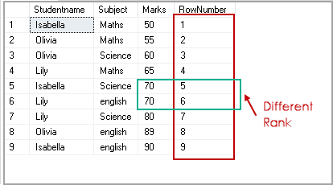
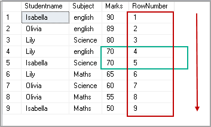
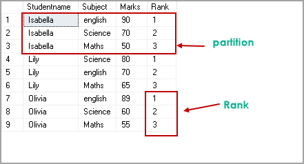
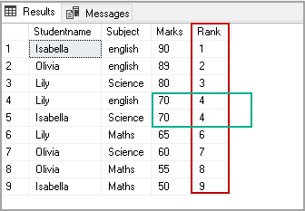
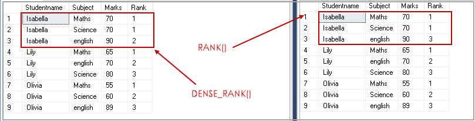
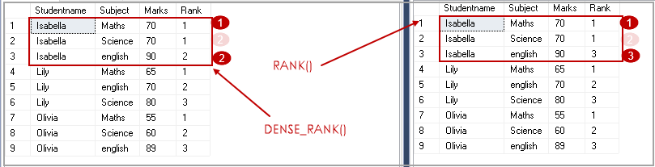
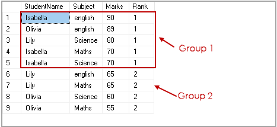
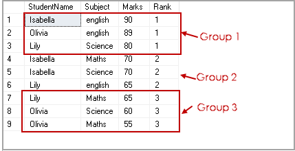
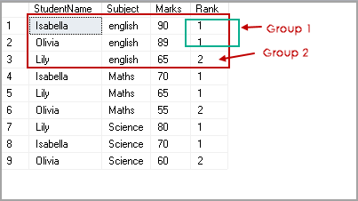

# SQL

**Источник:** enhorse/java-interview  
**Вопросов:** 35

## 1. Что такое _«SQL»_?

<span class="source-badge">Источник: enhorse/java-interview</span>

SQL, Structured query language («язык структурированных запросов») — формальный непроцедурный язык программирования, применяемый для создания, модификации и управления данными в произвольной реляционной базе данных, управляемой соответствующей системой управления базами данных (СУБД).

[к оглавлению](#sql)

---

## 2. Какие существуют операторы SQL?

<span class="source-badge">Источник: enhorse/java-interview</span>

__операторы определения данных (Data Definition Language, DDL)__:

+ `CREATE` создает объект БД (базу, таблицу, представление, пользователя и т. д.),
+ `ALTER` изменяет объект,
+ `DROP` удаляет объект;

__операторы манипуляции данными (Data Manipulation Language, DML)__:

+ `SELECT` выбирает данные, удовлетворяющие заданным условиям,
+ `INSERT` добавляет новые данные,
+ `UPDATE` изменяет существующие данные,
+ `DELETE` удаляет данные;

__операторы определения доступа к данным (Data Control Language, DCL)__:

+ `GRANT` предоставляет пользователю (группе) разрешения на определенные операции с объектом,
+ `REVOKE` отзывает ранее выданные разрешения,
+ `DENY` задает запрет, имеющий приоритет над разрешением;

__операторы управления транзакциями (Transaction Control Language, TCL)__:

+ `COMMIT` применяет транзакцию,
+ `ROLLBACK` откатывает все изменения, сделанные в контексте текущей транзакции,
+ `SAVEPOINT` разбивает транзакцию на более мелкие.

[к оглавлению](#sql)

---

## 3. Что означает `NULL` в SQL?

<span class="source-badge">Источник: enhorse/java-interview</span>

`NULL` - специальное значение (псевдозначение), которое может быть записано в поле таблицы базы данных. NULL соответствует понятию «пустое поле», то есть «поле, не содержащее никакого значения».

`NULL` означает отсутствие, неизвестность информации. Значение `NULL` не является значением в полном смысле слова: по определению оно означает отсутствие значения и не принадлежит ни одному типу данных. Поэтому `NULL` не равно ни логическому значению `FALSE`, ни _пустой строке_, ни `0`. При сравнении `NULL` с любым значением будет получен результат `NULL`, а не `FALSE` и не `0`. Более того, `NULL` не равно `NULL`!

[к оглавлению](#sql)

---

## 4. Что такое _«временная таблица»_? Для чего она используется?

<span class="source-badge">Источник: enhorse/java-interview</span>

__Временная таблица__ - это объект базы данных, который хранится и управляется системой базы данных на временной основе. Они могут быть локальными или глобальными. Используется для сохранения результатов вызова хранимой процедуры, уменьшение числа строк при соединениях, агрегирование данных из различных источников или как замена курсоров и параметризованных представлений.

[к оглавлению](#sql)

---

## 5. Что такое _«представление» (view)_ и для чего оно применяется?

<span class="source-badge">Источник: enhorse/java-interview</span>

__Представление__, View - виртуальная таблица, представляющая данные одной или более таблиц альтернативным образом.

В действительности представление – всего лишь результат выполнения оператора `SELECT`, который хранится в структуре памяти, напоминающей SQL таблицу. Они работают в запросах и операторах DML точно также как и основные таблицы, но не содержат никаких собственных данных. Представления значительно расширяют возможности управления данными. Это способ дать публичный доступ к некоторой (но не всей) информации в таблице.

[к оглавлению](#sql)

---

## 6. Каков общий синтаксис оператора `SELECT`?

<span class="source-badge">Источник: enhorse/java-interview</span>

`SELECT` - оператор DML SQL, возвращающий набор данных (выборку) из базы данных, удовлетворяющих заданному условию. Имеет следующую структуру:

```sql
SELECT 
       [DISTINCT | DISTINCTROW | ALL]
       select_expression,...
   FROM table_references
     [WHERE where_definition]
     [GROUP BY {unsigned_integer | column | formula}]
     [HAVING where_definition]
     [ORDER BY {unsigned_integer | column | formula} [ASC | DESC], ...]
```

[к оглавлению](#sql)

---

## 7. Что такое `JOIN`?

<span class="source-badge">Источник: enhorse/java-interview</span>

__JOIN__ - оператор языка SQL, который является реализацией операции соединения реляционной алгебры. Предназначен для обеспечения выборки данных из двух таблиц и включения этих данных в один результирующий набор. 

Особенностями операции соединения являются следующее:

+ в схему таблицы-результата входят столбцы обеих исходных таблиц (таблиц-операндов), то есть схема результата является «сцеплением» схем операндов;
+ каждая строка таблицы-результата является «сцеплением» строки из одной таблицы-операнда со строкой второй таблицы-операнда;
+ при необходимости соединения не двух, а нескольких таблиц, операция соединения применяется несколько раз (последовательно).

```sql
SELECT
  field_name [,... n]
FROM
  Table1
  {INNER | {LEFT | RIGHT | FULL} OUTER | CROSS } JOIN
  Table2
    {ON <condition> | USING (field_name [,... n])}
```

[к оглавлению](#sql)

---

## 8. Какие существуют типы `JOIN`?

<span class="source-badge">Источник: enhorse/java-interview</span>

__(INNER) JOIN__
Результатом объединения таблиц являются записи, общие для левой и правой таблиц. Порядок таблиц для оператора не важен, поскольку оператор является симметричным.

__LEFT (OUTER) JOIN__
Производит выбор всех записей первой таблицы и соответствующих им записей второй таблицы. Если записи во второй таблице не найдены, то вместо них подставляется пустой результат (`NULL`). Порядок таблиц для оператора важен, поскольку оператор не является симметричным.

__RIGHT (OUTER) JOIN__
`LEFT JOIN` с операндами, расставленными в обратном порядке. Порядок таблиц для оператора важен, поскольку оператор не является симметричным.

__FULL (OUTER) JOIN__
Результатом объединения таблиц являются все записи, которые присутствуют в таблицах. Порядок таблиц для оператора не важен, поскольку оператор является симметричным.

__CROSS JOIN (декартово произведение)__
При выборе каждая строка одной таблицы объединяется с каждой строкой второй таблицы, давая тем самым все возможные сочетания строк двух таблиц. Порядок таблиц для оператора не важен, поскольку оператор является симметричным.

[к оглавлению](#sql)

---

## 9. Что лучше использовать `JOIN` или подзапросы?

<span class="source-badge">Источник: enhorse/java-interview</span>

Обычно лучше использовать `JOIN`, поскольку в большинстве случаев он более понятен и лучше оптимизируется СУБД (но 100% этого гарантировать нельзя). Так же `JOIN` имеет заметное преимущество над подзапросами в случае, когда список выбора `SELECT` содержит столбцы более чем из одной таблицы.

Подзапросы лучше использовать в случаях, когда нужно вычислять агрегатные значения и использовать их для сравнений во внешних запросах.

[к оглавлению](#sql)

---

## 10. Для чего используется оператор `HAVING`?

<span class="source-badge">Источник: enhorse/java-interview</span>

`HAVING` используется для фильтрации результата `GROUP BY` по заданным логическим условиям.

[к оглавлению](#sql)

---

## 11. В чем различие между операторами `HAVING` и `WHERE`?

<span class="source-badge">Источник: enhorse/java-interview</span>

Основное отличие 'WHERE' от 'HAVING' заключается в том, что 'WHERE' сначала выбирает строки, а затем группирует их и вычисляет агрегатные функции (таким образом, она отбирает строки для вычисления агрегатов), тогда как 'HAVING' отбирает строки групп после группировки и вычисления агрегатных функций. Как следствие, предложение 'WHERE' не должно содержать агрегатных функций; не имеет смысла использовать агрегатные функции для определения строк для вычисления агрегатных функций. Предложение 'HAVING', напротив, всегда содержит агрегатные функции. (Строго говоря, вы можете написать предложение 'HAVING', не используя агрегаты, но это редко бывает полезно. То же самое условие может работать более эффективно на стадии 'WHERE'.)

[к оглавлению](#sql)

---

## 12. Для чего используется оператор `ORDER BY`?

<span class="source-badge">Источник: enhorse/java-interview</span>

__ORDER BY__ упорядочивает вывод запроса согласно значениям в том или ином количестве выбранных столбцов. Многочисленные столбцы упорядочиваются один внутри другого. Возможно определять возрастание `ASC` или убывание `DESC` для каждого столбца. По умолчанию установлено - возрастание.

[к оглавлению](#sql)

---

## 13. Для чего используется оператор `GROUP BY`?

<span class="source-badge">Источник: enhorse/java-interview</span>

`GROUP BY` используется для агрегации записей результата по заданным признакам-атрибутам.

[к оглавлению](#sql)

---

## 14. Как `GROUP BY` обрабатывает значение `NULL`?

<span class="source-badge">Источник: enhorse/java-interview</span>

При использовании `GROUP BY` все значения `NULL` считаются равными.

[к оглавлению](#sql)

---

## 15. В чем разница между операторами `GROUP BY` и `DISTINCT`?

<span class="source-badge">Источник: enhorse/java-interview</span>

`DISTINCT` указывает, что для вычислений используются только уникальные значения столбца. `NULL` считается как отдельное значение. 
`GROUP BY` создает отдельную группу для всех возможных значений (включая значение `NULL`). 

Если нужно удалить только дубликаты лучше использовать `DISTINCT`, `GROUP BY` лучше использовать для определения групп записей, к которым могут применяться агрегатные функции.

[к оглавлению](#sql)

---

## 16. Перечислите основные агрегатные функции.

<span class="source-badge">Источник: enhorse/java-interview</span>

__Агрегатных функции__ - функции, которые берут группы значений и сводят их к одиночному значению. 

SQL предоставляет несколько агрегатных функций:

`COUNT` - производит подсчет записей, удовлетворяющих условию запроса;
`SUM` - вычисляет арифметическую сумму всех значений колонки;
`AVG` - вычисляет среднее арифметическое всех значений;
`MAX` - определяет наибольшее из всех выбранных значений;
`MIN` - определяет наименьшее из всех выбранных значений.

[к оглавлению](#sql)

---

## 17. В чем разница между `COUNT(*)` и `COUNT({column})`?

<span class="source-badge">Источник: enhorse/java-interview</span>

`COUNT (*)` подсчитывает количество записей в таблице, не игнорируя значение NULL, поскольку эта функция оперирует записями, а не столбцами.

`COUNT ({column})` подсчитывает количество значений в `{column}`. При подсчете количества значений столбца эта форма функции `COUNT` не принимает во внимание значение `NULL`.

[к оглавлению](#sql)

---

## 18. Что делает оператор `EXISTS`?

<span class="source-badge">Источник: enhorse/java-interview</span>

`EXISTS` берет подзапрос, как аргумент, и оценивает его как `TRUE`, если подзапрос возвращает какие-либо записи и `FALSE`, если нет.

[к оглавлению](#sql)

---

## 19. Для чего используются операторы `IN`, `BETWEEN`, `LIKE`?

<span class="source-badge">Источник: enhorse/java-interview</span>

`IN` - определяет набор значений.

```sql 
SELECT * FROM Persons WHERE name IN ('Ivan','Petr','Pavel');
```

`BETWEEN` определяет диапазон значений. В отличие от `IN`, `BETWEEN` чувствителен к порядку, и первое значение в предложении должно быть первым по алфавитному или числовому порядку.

```sql 
SELECT * FROM Persons WHERE age BETWEEN 20 AND 25;
```

`LIKE` применим только к полям типа `CHAR` или `VARCHAR`, с которыми он используется чтобы находить подстроки. В качестве условия используются _символы шаблонизации (wildkards_) - специальные символы, которые могут соответствовать чему-нибудь: 

+ `_` замещает любой одиночный символ. Например, `'b_t'` будет соответствовать словам `'bat'` или `'bit'`, но не будет соответствовать `'brat'`. 

+ `%` замещает последовательность любого числа символов. Например `'%p%t'` будет соответствовать словам `'put'`, `'posit'`, или `'opt'`, но не `'spite'`.

```sql 
SELECT * FROM UNIVERSITY WHERE NAME LIKE '%o';
```

[к оглавлению](#sql)

---

## 20. Для чего применяется ключевое слово `UNION`?

<span class="source-badge">Источник: enhorse/java-interview</span>

В языке SQL ключевое слово `UNION` применяется для объединения результатов двух SQL-запросов в единую таблицу, состоящую из схожих записей. Оба запроса должны возвращать одинаковое число столбцов и совместимые типы данных в соответствующих столбцах. Необходимо отметить, что `UNION` сам по себе не гарантирует порядок записей. Записи из второго запроса могут оказаться в начале, в конце или вообще перемешаться с записями из первого запроса. В случаях, когда требуется определенный порядок, необходимо использовать `ORDER BY`.

[к оглавлению](#sql)

---

## 21. Какие ограничения на целостность данных существуют в SQL?

<span class="source-badge">Источник: enhorse/java-interview</span>

`PRIMARY KEY` - набор полей (1 или более), значения которых образуют уникальную комбинацию и используются для однозначной идентификации записи в таблице. Для таблицы может быть создано только одно такое ограничение. Данное ограничение используется для обеспечения целостности сущности, которая описана таблицей.

`CHECK` используется для ограничения множества значений, которые могут быть помещены в данный столбец. Это ограничение используется для обеспечения целостности предметной области, которую описывают таблицы в базе.

`UNIQUE` обеспечивает отсутствие дубликатов в столбце или наборе столбцов.

`FOREIGN KEY` защищает от действий, которые могут нарушить связи между таблицами. `FOREIGN KEY` в одной таблице указывает на `PRIMARY KEY` в другой. Поэтому данное ограничение нацелено на то, чтобы не было записей `FOREIGN KEY`, которым не отвечают записи `PRIMARY KEY`.

[к оглавлению](#sql)

---

## 22. Какие отличия между ограничениями `PRIMARY` и `UNIQUE`?

<span class="source-badge">Источник: enhorse/java-interview</span>

По умолчанию ограничение `PRIMARY` создает кластерный индекс на столбце, а `UNIQUE` - некластерный. Другим отличием является то, что `PRIMARY` не разрешает `NULL` записей, в то время как `UNIQUE` разрешает одну (а в некоторых СУБД несколько) `NULL` запись.

[к оглавлению](#sql)

---

## 23. Может ли значение в столбце, на который наложено ограничение `FOREIGN KEY`, равняться `NULL`?

<span class="source-badge">Источник: enhorse/java-interview</span>

Может, если на данный столбец не наложено ограничение `NOT NULL`. 

[к оглавлению](#sql)

---

## 24. Как создать индекс?

<span class="source-badge">Источник: enhorse/java-interview</span>

Индекс можно создать либо с помощью выражения `CREATE INDEX`: 
```sql
CREATE INDEX index_name ON table_name (column_name)
```

либо указав ограничение целостности в виде уникального `UNIQUE` или первичного `PRIMARY` ключа в операторе создания таблицы `CREATE TABLE`.

[к оглавлению](#sql)

---

## 25. Что делает оператор `MERGE`?

<span class="source-badge">Источник: enhorse/java-interview</span>

`MERGE` позволяет осуществить слияние данных одной таблицы с данными другой таблицы. При слиянии таблиц проверяется условие, и если оно истинно, то выполняется `UPDATE`, а если нет - `INSERT`. При этом изменять поля таблицы в секции `UPDATE`, по которым идет связывание двух таблиц, нельзя.

[к оглавлению](#sql)

---

## 26. В чем отличие между операторами `DELETE` и `TRUNCATE`?

<span class="source-badge">Источник: enhorse/java-interview</span>

`DELETE` - оператор DML, удаляет записи из таблицы, которые удовлетворяют критерию `WHERE` при этом задействуются триггеры, ограничения и т.д.

`TRUNCATE` - DDL оператор (удаляет таблицу и создает ее заново. Причем если на эту таблицу есть ссылки `FOREGIN KEY` или таблица используется в репликации, то пересоздать такую таблицу не получится).

[к оглавлению](#sql)

---

## 27. Что такое _«хранимая процедура»_?

<span class="source-badge">Источник: enhorse/java-interview</span>

__Хранимая процедура__ — объект базы данных, представляющий собой набор SQL-инструкций, который хранится на сервере. Хранимые процедуры очень похожи на обыкновенные процедуры языков высокого уровня, у них могут быть входные и выходные параметры и локальные переменные, в них могут производиться числовые вычисления и операции над символьными данными, результаты которых могут присваиваться переменным и параметрам. В хранимых процедурах могут выполняться стандартные операции с базами данных (как DDL, так и DML). Кроме того, в хранимых процедурах возможны циклы и ветвления, то есть в них могут использоваться инструкции управления процессом исполнения.

Хранимые процедуры позволяют повысить производительность, расширяют возможности программирования и поддерживают функции безопасности данных. В большинстве СУБД при первом запуске хранимой процедуры она компилируется (выполняется синтаксический анализ и генерируется план доступа к данным) и в дальнейшем её обработка осуществляется быстрее.

[к оглавлению](#sql)

---

## 28. Что такое _«триггер»_?

<span class="source-badge">Источник: enhorse/java-interview</span>

__Триггер (trigger)__ — это хранимая процедура особого типа, которую пользователь не вызывает непосредственно, а исполнение которой обусловлено действием по модификации данных: добавлением, удалением или изменением данных в заданной таблице реляционной базы данных. Триггеры применяются для обеспечения целостности данных и реализации сложной бизнес-логики. Триггер запускается сервером автоматически и все производимые им модификации данных рассматриваются как выполняемые в транзакции, в которой выполнено действие, вызвавшее срабатывание триггера. Соответственно, в случае обнаружения ошибки или нарушения целостности данных может произойти откат этой транзакции.

Момент запуска триггера определяется с помощью ключевых слов `BEFORE` (триггер запускается до выполнения связанного с ним события) или `AFTER` (после события). В случае, если триггер вызывается до события, он может внести изменения в модифицируемую событием запись. Кроме того, триггеры могут быть привязаны не к таблице, а к представлению (VIEW). В этом случае с их помощью реализуется механизм «обновляемого представления». В этом случае ключевые слова `BEFORE` и `AFTER` влияют лишь на последовательность вызова триггеров, так как собственно событие (удаление, вставка или обновление) не происходит.

[к оглавлению](#sql)

---

## 29. Что такое _«курсор»_?

<span class="source-badge">Источник: enhorse/java-interview</span>

__Курсор__ — это объект базы данных, который позволяет приложениям работать с записями «по-одной», а не сразу с множеством, как это делается в обычных SQL командах.

Порядок работы с курсором такой:

+ Определить курсор (`DECLARE`)
+ Открыть курсор (`OPEN`)
+ Получить запись из курсора (`FETCH`)
+ Обработать запись...
+ Закрыть курсор (`CLOSE`)
+ Удалить ссылку курсора (`DEALLOCATE`). Когда удаляется последняя ссылка курсора, SQL освобождает структуры данных, составляющие курсор.

[к оглавлению](#sql)

---

## 30. Опишите разницу типов данных `DATETIME` и `TIMESTAMP`.

<span class="source-badge">Источник: enhorse/java-interview</span>

`DATETIME` предназначен для хранения целого числа: `YYYYMMDDHHMMSS`. И это время не зависит от временной зоны, настроенной на сервере.
Размер: 8 байт

`TIMESTAMP` хранит значение равное количеству секунд, прошедших с полуночи 1 января 1970 года по усреднённому времени Гринвича. При получении из базы отображается с учётом часового пояса. Размер: 4 байта

[к оглавлению](#sql)

---

## 31. Для каких числовых типов недопустимо использовать операции сложения/вычитания?

<span class="source-badge">Источник: enhorse/java-interview</span>

В качестве операндов операций сложения и вычитания нельзя использовать числовой тип `BIT`.

[к оглавлению](#sql)

---

## 32. Какое назначение у операторов `PIVOT` и `UNPIVOT` в Transact-SQL?

<span class="source-badge">Источник: enhorse/java-interview</span>

`PIVOT` и `UNPIVOT` являются нестандартными реляционными операторами, которые поддерживаются Transact-SQL. 

Оператор `PIVOT` разворачивает возвращающее табличное значение выражение, преобразуя уникальные значения одного столбца выражения в несколько выходных столбцов, а также, в случае необходимости, объединяет оставшиеся повторяющиеся значения столбца и отображает их в выходных данных. Оператор `UNPIVOT` производит действия, обратные `PIVOT`, преобразуя столбцы возвращающего табличное значение выражения в значения столбца.

[к оглавлению](#sql)

---

## 33. Расскажите об основных функциях ранжирования в Transact-SQL.

<span class="source-badge">Источник: enhorse/java-interview</span>

Ранжирующие функции - это функции, которые возвращают значение для каждой записи группы в результирующем наборе данных. На практике они могут быть использованы, например, для простой нумерации списка, составления рейтинга или постраничной навигации.

К примеру, у нас имеется набор данных следующего вида:



`ROW_NUMBER` – функция нумерации в Transact-SQL, которая возвращает просто номер записи.

Например, запрос 
```sql
SELECT Studentname, 
       Subject, 
       Marks, 
       ROW_NUMBER() OVER(ORDER BY Marks) RowNumber
FROM ExamResult;
```
Вернёт набор данных следующего вида:


А запрос вида
```sql
SELECT Studentname, 
       Subject, 
       Marks, 
       ROW_NUMBER() OVER(ORDER BY Marks desc) RowNumber
FROM ExamResult;
```

Вернёт набор




`RANK` возвращает ранг каждой записи. В данном случае, в отличие от `ROW_NUMBER`, идет уже анализ значений и в случае нахождения одинаковых возвращает одинаковый ранг с пропуском следующего.

Например:

```sql
SELECT Studentname, 
       Subject, 
       Marks, 
       RANK() OVER(PARTITION BY Studentname ORDER BY Marks DESC) Rank
FROM ExamResult
ORDER BY Studentname, 
         Rank;
```

Результат:



Ещё пример:

```sql
SELECT Studentname, 
       Subject, 
       Marks, 
       RANK() OVER(ORDER BY Marks DESC) Rank
FROM ExamResult
ORDER BY Rank;
```

Результат:




`DENSE_RANK` так же возвращает ранг каждой записи, но в отличие от `RANK` в случае нахождения одинаковых значений возвращает ранг без пропуска следующего.

Например:

```sql
SELECT Studentname, 
       Subject, 
       Marks, 
       DENSE_RANK() OVER(ORDER BY Marks DESC) Rank
FROM ExamResult
ORDER BY Rank;
```

Результат:


Ещё пример:

```sql
SELECT Studentname, 
       Subject, 
       Marks, 
       DENSE_RANK() OVER(PARTITION BY Subject ORDER BY Marks DESC) Rank
FROM ExamResult
ORDER BY Studentname, 
         Rank;
```

Результат:


Ну, и на последок, продемонстрируем разницу между `DENSE_RANK` и `RANK`:

```sql
SELECT Studentname, 
       Subject, 
       Marks, 
       RANK() OVER(PARTITION BY StudentName ORDER BY Marks ) Rank
FROM ExamResult
ORDER BY Studentname, 
         Rank;
```


```sql
SELECT Studentname, 
       Subject, 
       Marks, 
       DENSE_RANK() OVER(PARTITION BY StudentName ORDER BY Marks ) Rank
FROM ExamResult
ORDER BY Studentname, 
         Rank;
```






`NTILE` – функция Transact-SQL, которая делит результирующий набор на группы по определенному столбцу. 

Например:

```sql
SELECT *, 
       NTILE(2) OVER(
       ORDER BY Marks DESC) Rank
FROM ExamResult
ORDER BY rank;
```

Результат:



Пример 2:

```sql
SELECT *, 
       NTILE(3) OVER(
       ORDER BY Marks DESC) Rank
FROM ExamResult
ORDER BY rank;
```

Результат:



Пример 3:

```sql
SELECT *, 
       NTILE(2) OVER(PARTITION  BY subject ORDER BY Marks DESC) Rank
FROM ExamResult
ORDER BY subject, rank;
```

Результат:



[к оглавлению](#sql)

---

## 34. Для чего используются операторы `INTERSECT`, `EXCEPT` в Transact-SQL?

<span class="source-badge">Источник: enhorse/java-interview</span>

Оператор `EXCEPT` возвращает уникальные записи из левого входного запроса, которые не выводятся правым входным запросом.

Оператор `INTERSECT` возвращает уникальные записи, выводимые левым и правым входными запросами.

[к оглавлению](#sql)

---

## 35. Напишите запрос...

<span class="source-badge">Источник: enhorse/java-interview</span>

```sql
CREATE TABLE table ( 
  id BIGINT(20) NOT NULL AUTO_INCREMENT, 
  created TIMESTAMP NOT NULL DEFAULT 0,
  PRIMARY KEY (id) 
);
```

Требуется написать запрос, который вернет максимальное значение `id` и значение `created` для этого `id`:

```sql
SELECT id, created FROM table where id = (SELECT MAX(id) FROM table);
```

---

```sql
CREATE TABLE track_downloads ( 
  download_id BIGINT(20) NOT NULL AUTO_INCREMENT, 
  track_id INT NOT NULL, 
  user_id BIGINT(20) NOT NULL, 
  download_time TIMESTAMP NOT NULL DEFAULT 0, 
  PRIMARY KEY (download_id) 
);
```

Напишите SQL-запрос, возвращающий все пары `(download_count, user_count)`, удовлетворяющие следующему условию: `user_count` — общее ненулевое число пользователей, сделавших ровно `download_count` скачиваний `19 ноября 2010 года`:

```sql
SELECT DISTINCT download_count, COUNT(*) AS user_count 
FROM ( 
    SELECT COUNT(*) AS download_count  
    FROM track_downloads WHERE download_time="2010-11-19" 
    GROUP BY user_id)  
AS download_count
GROUP BY download_count; 
```

[к оглавлению](#sql)

---
