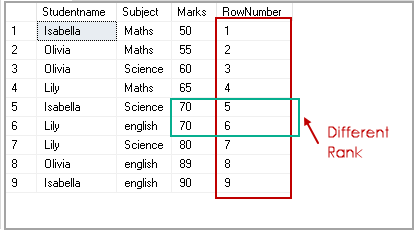
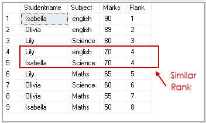
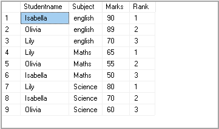

# SQL

Всего вопросов: **102**

<span class="priority-badge priority-high">🔥 Высокий приоритет</span>

## 1. Уровни изолированности (read uncommitted, read committed, repeatable read, serializable)

<div class="answer-block">

[Статья на хабре про уровни изоляции](https://habr.com/ru/articles/845522/)

От менее строгого к самому строгому:
- Read uncommited (незащищённое чтение) - транзакции могут читать данные, которые еще не зафиксированы другими транзакциями (использовать, когда все транзакции на чтение)
- Read commited (защищённое чтение) - транзакции могут читать только те данные, которые уже зафиксированы другими данными (решает потерянное обновление и грязное чтение)
- Repeatable read (повторяющееся чтение) - в рамках одной транзакции многократный запрос данных всегда возвращает одинаковый набор данных, независимо от изменений, сделанных другими транзакциями (решает потерянное обновление, грязное чтение и неповторяющееся чтение)
- Serializable - самый строгий уровень изоляции. Транзакции выполняются так, как будто происходят последовательно одна за другой (решает всё, но бьёт по производительности)

**Какой уровень изолированности стоит по умолчанию в MySQL?**
В MySQL - Repeatable read, в PostgreSQL - Read commited

**Зависимость скорости работы БД и уровня изоляции**

| **Уровень изоляции** | **Описание**                                                                                 | **Влияние на производительность**                                                          |
| -------------------- | -------------------------------------------------------------------------------------------- | ------------------------------------------------------------------------------------------ |
| Read Uncommitted     | Транзакции могут читать данные, которые ещё не зафиксированы                                 | Самый быстрый, но данные могут быть неконсистентными                                       |
| Read Committed       | Транзакции читают только зафиксированные данные                                              | Средняя производительность, баланс между скоростью и консистентностью                      |
| Repeatable Read      | Гарантирует, что данные, прочитанные транзакцией, не изменятся, пока транзакция не завершена | Снижает производительность из-за блокировок, но обеспечивает более высокую консистентность |
| Serializable         | Самый высокий уровень изоляции, предотвращает все виды аномалий                              | Самый медленный, так как использует полные блокировки                                      |

</div>

---

<span class="priority-badge priority-high">🔥 Высокий приоритет</span>

## 2. Оптимизация запросов. Какие существуют инструменты?

<div class="answer-block">

- **EXPLAIN** - показывает теоретический план выполнения запроса, что позволяет увидеть, как СУБД **планирует** извлекать данные
- **EXPLAIN ANALYZE** - выполняет запрос и показывает **реальный план выполнения**, включая затраченные ресурсы (время, память)
- **Indexes** - индексы ускоряют доступ к данным, особенно при использовании в условиях WHERE
- **pg_stat_statements** (для PostgreSQL) - модуль для сбора статистики выполнения запросов

**SQL-запрос у тебя в норме, но выполнение всё равно долгое. Твои действия?**
- **Оптимизация плана выполнения** - воспользоваться EXPLAIN и EXPLAIN ANALYZE для анализа плана выполнения запроса и поиска проблемных мест
- **Использование индексов** - проверить, правильно ли используются существующие индексы. При необходимости создать или изменить текущие
- **Рефакторинг запроса** - изменить структуру запроса, если есть более эффективный способ получить те же данные. Например, объединение нескольких подзапросов или использование более простых JOIN
- **Ресурсные ограничения** - проверить отсутствие ограничений по железу (нехватка CPU, памяти, диска)

</div>

---

<span class="priority-badge priority-high">🔥 Высокий приоритет</span>

## 3. Индексы в SQL. Что это?

<div class="answer-block">

Индексы в БД - это инструмент оптимизации/ускорения запросов путём создания упорядоченного набора указателей на строки таблицы. Ускорение происходит за счёт того, что структура индекса оптимизирована под поиск (например, b-tree). При этом, чем больше дубликатов в столбце - тем хуже работает индекс

**В индексе ссылка на данные или в самом индексе кешируем данные?**
В индексе хранятся **ссылки** на реальные данные, которые находятся в таблице базы данных. Эти ссылки могут быть представлены в виде:
- **указателей на строки** в таблице, где хранятся данные
- **идентификаторов записей**, которые позволяют найти данные в таблице

В Postgres в индексе хранятся **ссылки** на реальные данные, которые находятся в таблице базы данных. Например, в **B-tree**:
- промежуточные узлы дерева содержат только **ключи** для направления поиска
- в листьях дерева хранятся не сами данные, а **ссылки на данные** в таблице (или другие индексы)

Однако, можно создать покрывающий индекс - индекс, который включает не только ключи, но и значение колонки(ок). Такие индексы позволяют извлекать данные не обращаясь к таблице. Пример:
```sql
CREATE INDEX idx_price ON products(price) INCLUDE (name);
-- Теперь индекс хранит значения price + колонку name, что позволяет выполнить запрос
SELECT price, name FROM products WHERE price > 50;
-- не обращаясь к таблице
```

В MySQL (InnoDB) поведение индексов отличается в зависимости от их типа:
1. PRIMARY KEY (кластерный индекс) - индекс содержит сами данные
2. Обычный (SECONDARY INDEX) индекс хранит ссылки (ключи PRIMARY KEY) на данные

**Какие индексы по умолчанию в разных СУБД?**
По-умолчанию в большинстве CУБД стоит B-tree

**Сравнение сложности поиска**

|**Тип поиска**|**Структура**|**Сложность**|**Когда применять?**|
|---|---|---|---|
|**Без индекса**|Полный перебор|`O(N)`|Маленькие таблицы|
|**B-Tree индекс**|Сбалансированное дерево|`O(log N)`|Частый поиск по диапазонам|
|**Hash-индекс**|Хеш-таблица|`O(1)`|Быстрый поиск по `=`|

**Как добавить новый индекс в большую, активно используемую таблицу в продакшене, не блокируя доступ и не приостанавливая работу приложения, и какие стратегии можно применить для минимизации влияния на систему?**
- **PostgreSQL** - `CREATE INDEX CONCURRENTLY` / pg_repack / gh-ost
- **MySQL** - `ALTER TABLE … ALGORITHM=INPLACE, LOCK=NONE` / pt-online-schema-change

**Как определить, какой индекс будет использован в запросе с фильтрацией по столбцу с низкой селективностью (например, пол), и как селективность влияет на эффективность индексов?**
1. **EXPLAIN ANALYZE** покажет, будет ли `Index Scan` или `Seq Scan`
2. **pg_stats.n_distinct** даёт оценку числа уникальных значений

</div>

---

<span class="priority-badge priority-high">🔥 Высокий приоритет</span>

## 4. Блокировки и локи. Оптимистичная и Пессимистичная

<div class="answer-block">

Блокировки (или локи) в базе данных - это механизм, управляющий конкурентным доступом к данным, чтобы избежать конфликтов и ошибок. Есть два типа блокировок

**Оптимистическая блокировка** - при завершении транзакции сверяется текущая версия данных и версия, полученная в начале транзакции. Если они не совпадают, то транзакция откатывается. Подразумевает, что конфликты будут происходить нечасто
```sql
SELECT version 
FROM orders 
WHERE id = 1;

-- Обновляем, если версия не изменилась
UPDATE orders
SET status = 'processed', version = version + 1
WHERE id = 1 AND version = 5;
```

**Пессимистическая блокировка** - при начале транзакции изменяемые данные блокируются для всех остальных, пока текущая транзакция не закончится
```sql
SELECT *
FROM orders
WHERE id = 1 
FOR UPDATE;
```

**Сравнение**

| **Характеристика**   | **Оптимистичные локи**         | **Пессимистичные локи**   |
| -------------------- | ------------------------------ | ------------------------- |
| Конфликты            | Редкие                         | Частые                    |
| Механизм             | Проверка версии данных         | Блокировка ресурса        |
| Производительность   | Выше при редких конфликтах     | Ниже из-за блокировок     |
| Обработка конфликтов | Требует доп. кода              | Не требуется              |
| Применимость         | Чтение превалирует над записью | Высококонкурентная запись |

</div>

---

<span class="priority-badge priority-high">🔥 Высокий приоритет</span>

## 5. Какие виды индексов знаешь?

<div class="answer-block">

| **Тип индекса**                                          | **Описание**                                                                                                                                                      | **Использование**                                                                                      |
| -------------------------------------------------------- | ----------------------------------------------------------------------------------------------------------------------------------------------------------------- | ------------------------------------------------------------------------------------------------------ |
| B-дерево (B-tree)                                        | Стандартный индекс, используемый в большинстве СУБД. Данные хранятся в сбалансированном дереве                                                                    | Для поиска, сортировки, диапазонных запросов                                                           |
| Хеш-индекс (Hash Index)                                  | Использует хеш-функцию для поиска точных совпадений                                                                                                               | Для быстрого поиска по уникальным значениям (например, ID)                                             |
| Индекс с несколькими столбцами (Composite Index)         | Индекс, включающий несколько столбцов. Ускоряет запросы, использующие несколько фильтров                                                                          | Когда запросы фильтруют по нескольким столбцам одновременно                                            |
| Индекс с уникальными значениями (Unique Index)           | Индекс, обеспечивающий уникальность значений в столбце                                                                                                            | Для обеспечения уникальности значений (например, email)                                                |
| Индекс полного текста (Full-Text Index)                  | Индекс для быстрого поиска по тексту, включая ключевые слова и фразы                                                                                              | Поиск по длинным текстовым полям, например, в статьях или документах                                   |
| Индекс обратного списка (Bitmap Index)                   | Индекс с битовыми картами для колонок с малым числом уникальных значений                                                                                          | Для столбцов с ограниченным числом уникальных значений, например, пол                                  |
| Инкрементный (Clustered Index)                           | Индекс, при котором данные таблицы физически упорядочены в соответствии с индексом                                                                                | Когда необходимо хранить данные в порядке индекса, например, по ID                                     |
| Индекс по выражению (Functional Index)                   | Индекс, основанный на вычисленных значениях или функциях над столбцами                                                                                            | Для запросов, использующих функции или выражения в фильтрах                                            |
| Индекс на основе дерева (GiST — Generalized Search Tree) | Общий тип дерева, используемый для индексации сложных типов данных                                                                                                | Для индексации географических данных или других сложных типов                                          |
| Индекс на основе префикса (Prefix Index)                 | Индекс, созданный на части строки, например, на первых символах                                                                                                   | Для текстовых полей, где важно индексировать только часть строки (например, первые несколько символов) |
| GIN (Generalized Inverted Index)                         | Инвертированная структура: GIN создает карту, связывающую значения (ключи) с идентификаторами строк (TID), в которых эти значения встречаются. B-tree под капотом | Идеален для&lt;br&gt;`JSONB` (операторы `@>`, `?`), &lt;br&gt;`ARRAY` (операторы `<@`, `@>`, `&&`)&lt;br&gt;             |
| Покрывающий индекс (Covering Index)                      | Схож с композитным, но INCLUDE-колонки не участвуют в поиске/фильтрации&lt;br&gt;&lt;br&gt;CREATE INDEX idx_users_cover&lt;br&gt;ON users(email)&lt;br&gt;INCLUDE(name, age)              | Для определённого набора часто запрашиваемых полей, не участвующих в фильтрации                        |

</div>

---

<span class="priority-badge priority-high">🔥 Высокий приоритет</span>

## 6. Расскажите про ACID

<div class="answer-block">

ACID - это набор свойств, гарантирующих надёжность транзакции:
- **A**tomicity (атомарность/неделимость операций) - все операции внутри транзакции либо выполняются полностью, либо не выполняются совсем
- **C**onsistency (согласованность данных) - после транзакции данные соблюдают все правила целостности (правила целостности определяются бизнес-логикой)
- **I**solation (изоляция) - во время выполнения транзакции параллельные транзакции не должны оказывать влияние на ее результат
- **D**urability (долговечность/живучесть) - гарантирует, что закоммиченные изменения не могут быть потеряны ни при каких сбоях (поломка сервера, отключение электроэнергии и т.д.)

</div>

---

<span class="priority-badge priority-high">🔥 Высокий приоритет</span>

## 7. Виды JOIN. Как работает каждый JOIN?

<div class="answer-block">

Оператор, позволяющий связать данные из двух таблиц. Бывают:
- **(INNER) JOIN** - выдаст общее для левой и правой таблицы (может быть заменён WHERE)
- **LEFT (OUTER) JOIN** - выдаст все значения с левой таблицы и все подходящие с правой
- **RIGHT (OUTER) JOIN** - выдаст все значения с правой таблицы и все подходящие с левой
- **FULL (OUTER) JOIN** - выдаст все записи, которые присутствуют в таблицах
- **CROSS JOIN** - создаст декартово произведение двух таблиц (если в первой таблице 5 строк, а во второй 3, то вернет 5 x 3 = 15)
- **NATURAL JOIN** - объединяет таблицы по столбцам с одинаковыми именами, если значения в этих столбцах совпадают
- **SELF JOIN** - соединяет таблицу с самой собой

</div>

---

<span class="priority-badge priority-high">🔥 Высокий приоритет</span>

## 8. Что такое транзакции?

<div class="answer-block">

Транзакция - это набор логически связанных запросов, выполняемых атомарно (либо выполняются все - commit транзакции, либо откат всего - rollback)

</div>

---

<span class="priority-badge priority-medium">⭐ Средний приоритет</span>

## 9. Что такое _«триггер»_?

<div class="answer-block">

__Триггер (trigger)__ — это хранимая процедура особого типа, которую пользователь не вызывает непосредственно, а исполнение которой обусловлено действием по модификации данных: добавлением, удалением или изменением данных в заданной таблице реляционной базы данных. Триггеры применяются для обеспечения целостности данных и реализации сложной бизнес-логики. Триггер запускается сервером автоматически и все производимые им модификации данных рассматриваются как выполняемые в транзакции, в которой выполнено действие, вызвавшее срабатывание триггера. Соответственно, в случае обнаружения ошибки или нарушения целостности данных может произойти откат этой транзакции.

Момент запуска триггера определяется с помощью ключевых слов `BEFORE` (триггер запускается до выполнения связанного с ним события) или `AFTER` (после события). В случае, если триггер вызывается до события, он может внести изменения в модифицируемую событием запись. Кроме того, триггеры могут быть привязаны не к таблице, а к представлению (VIEW). В этом случае с их помощью реализуется механизм «обновляемого представления». В этом случае ключевые слова `BEFORE` и `AFTER` влияют лишь на последовательность вызова триггеров, так как собственно событие (удаление, вставка или обновление) не происходит.

[к оглавлению](#sql)

</div>

---

<span class="priority-badge priority-medium">⭐ Средний приоритет</span>

## 10. EXPLAIN vs EXPLAIN ANALYZE

<div class="answer-block">

EXPLAIN показывает план выполнения запроса до его фактического выполнения. Он выводит, как СУБД собирается получить данные. Это включает:
- какой тип сканирования будет применяться (Seq Scan, Index Scan)
- сортировки и объединения (Nested Loop, Hash Join)
- предполагаемое количество строк и стоимость выполнения на каждом этапе

**Explain analyze. Как устроен? На что обращать внимание?**
EXPLAIN ANALYZE не только показывает план выполнения, но и выполняет запрос, выводя фактическое время выполнения каждой операции. Полезные моменты:
- **фактическое время** (Actual Time) - сколько времени заняла операция
- **ROWS** - реальное количество строк, прошедших через каждый этап
- **LOOPS** - количество раз, когда этот шаг был выполнен (важно для вложенных циклов)
```sql
EXPLAIN ANALYZE SELECT * FROM employees WHERE salary > 100000;
```

</div>

---

<span class="priority-badge priority-medium">⭐ Средний приоритет</span>

## 11. Проблемы параллельных транзакций

<div class="answer-block">

- **Грязное чтение (dirty read)** - возможность чтения одной транзакцией незакоммиченных данных другой транзакции. Транзакция A обновляет значение в базе данных, но еще не закоммитила их. Транзакция B считывает это значение, не зная, что изменения могут быть отменены. Если транзакция A отменяется, значение, прочитанное транзакцией B, было “грязным”, так как оно не отражает окончательное состояние базы данных. Решается уровнем изоляции **read committed** и выше
- **Потерянное обновление (lost update)** - при одновременном изменении одних и тех же данных разными транзакциями в силу вступают только изменения в последней транзакции. Решается **repeatable read** и выше
- **Неповторяющееся чтение (non-repeatable read)** - возникает при изменении самих данных. Т.е. когда в рамках одной транзакции два чтения одних и тех же данных с промежутком времени дают два разных результата. Решается **repeatable read** и выше
- **Фантомное чтение (phantom read)** - возникает при изменении объёма данных / строк. Т.е. во время одной транзакции другая транзакция добавила несколько строк в таблицу и закоммитила изменения. Во время повторного запроса данных первая транзакция получит больше данных (исходные + “фантомные” записи из другой транзакции)

В Postgres `Repeatable Read` реализован через MVCC настолько строго, что фантомное чтение там фактически не возникает (хотя стандарт SQL это допускает)

**MVCC** (**Multiversion Concurrency Control**) - это метод управления конкурентным доступом к данным в БД, который позволяет нескольким транзакциям работать с данными одновременно без конфликтов. MVCC поддерживает высокую производительность и изоляцию транзакций, минимизируя блокировки и улучшая параллелизм.
- **Многоверсионность**:
  MVCC использует механизм многоверсионности для управления изменениями данных. Вместо того чтобы изменять данные в месте их хранения, MVCC создает новые версии данных. Каждая транзакция видит данные в том состоянии, в котором они были на момент начала транзакции, а не в текущем состоянии.
  При записи данных создается новая версия строки. Новая версия включает информацию о том, какая транзакция создала ее, и становится видимой для транзакций, которые начинаются после ее создания.
  Благодаря тому, что в версии указано, какая транзакция создала её и когда данные были созданы или удалены, можно определить, какая версия доступна для конкретной транзакции.
  Время от времени СУБД очищает старые версии данных, которые больше не нужны (т. е. которые уже не используются ни одной транзакцией). Это называется сбором мусора и помогает поддерживать эффективность системы.
- **Изоляция транзакций**:
  Транзакции видят только те данные, которые были зафиксированы до их начала. Это предотвращает грязное чтение, неповторяющееся чтение и фантомное чтение.
- **Отсутствие блокировок для чтения**:
  Чтение данных не блокирует запись, а запись не блокирует чтение. Это повышает производительность системы, поскольку транзакции могут работать с данными параллельно.
- **Управление конфликтами**:
  Конфликты между транзакциями, например, две транзакции, пытающиеся изменить одну и ту же строку, решаются при коммите транзакций. Если одна из транзакций не может быть закоммичена из‑за конфликта, её можно откатить.

</div>

---

<span class="priority-badge priority-medium">⭐ Средний приоритет</span>

## 12. Плюсы и минусы индексов

<div class="answer-block">

**Плюсы:**
- Улучшают производительность для select и сортировки по определенным полям

**Минусы:**
- Ухудшается производительность, когда нужно вставлять, обновлять или удалять данные
- Требуется дополнительное место и чем больше/длиннее ключ - тем больше размер индекса

</div>

---

<span class="priority-badge priority-medium">⭐ Средний приоритет</span>

## 13. Нормализация и денормализация. Перечислите формы

<div class="answer-block">

Нормализация - это процесс преобразования отношений базы данных к виду без избыточной информации. Избыточность - это ситуация, когда одни и те же данные хранятся в базе в нескольких местах. Нормализация проходит через несколько форм:
- **1NF** (1-я нормальная форма). Одна ячейка - одно значение.
- **2NF** (2-я нормальная форма). Все не ключевые колонки зависят от всего ключа.
- **3NF** (3-я нормальная форма). Все не ключевые колонки не зависят друг от друга.

Денормализация - процесс обратный нормализации. Обычно это необходимо для повышения производительности и скорости извлечения данных, за счет увеличения избыточности данных (влечёт уменьшение сложности запросов)

</div>

---

<span class="priority-badge priority-medium">⭐ Средний приоритет</span>

## 14. Чем WHERE отличается от HAVING? Можем ли мы их использовать в одном запросе?

<div class="answer-block">

WHERE отвечает за фильтр всех записей в запросе (до применения агрегатных функций), HAVING применяет фильтры к группам, сформированным GROUP BY

</div>

---

<span class="priority-badge priority-medium">⭐ Средний приоритет</span>

## 15. Почему когда много индексов, это плохо?

<div class="answer-block">

- Усложнение работы планировщика - СУБД может не выбрать лучший индекс для запроса, если их слишком много. Некоторые индексы могут быть избыточными, что не только не ускоряет запросы, но и увеличивает нагрузку на систему
- Утилизация места на жёстком диске - индексы занимают дополнительное место на диске пропорционально объёму данных и кол-ву выбранных столбцов
- Увеличение времени записи - при вставке, обновлении или удалении данных индексы нужно обновлять, что замедляет операции записи
- Усложнение управления - управление большим количеством индексов становится сложным, включая их отслеживание и обслуживании

</div>

---

<span class="priority-badge priority-medium">⭐ Средний приоритет</span>

## 16. C помощью SQL блокировка строки? - SELECT FOR UPDATE

<div class="answer-block">

**`SELECT FOR UPDATE`** используется для блокировки строк в таблице, участвующих в запросе до окончания транзакции, чтобы предотвратить их изменение другими транзакциями
```sql
BEGIN;

-- Блокировка строки с id = 1
SELECT * FROM accounts
WHERE id = 1
FOR UPDATE;

-- Делаем обновление
UPDATE accounts
SET balance = balance - 100
WHERE id = 1;

COMMIT;
```
- В данном случае, строка с `id = 1` заблокирована для других транзакций, пока текущая не завершится
- Если другая транзакция попытается заблокировать ту же строку, она будет ожидать завершения текущей транзакции

</div>

---

<span class="priority-badge priority-medium">⭐ Средний приоритет</span>

## 17. View, materialized view. Разница между обычным и материализованным представлением?

<div class="answer-block">

View (представление) - это сохранённый SQL-запрос, который служит для удобного (без необходимости повторно писать запрос) получения определённой выборки данных. Не хранит данные
```sql
CREATE VIEW ActiveUsers AS 
SELECT id, name, email 
FROM users 
 WHERE status = 'active'; 
 
 -- Использование представления 
 SELECT * FROM ActiveUsers;
```

Materialized View (материализованное представление) - это непосредственно выборка, полученная по какому-то запросу и сохранённая в памяти. Может ускорить выполнение сложных запросов за счёт того, что не перечитывает данные. Не актуализируется автоматически (требует `REFRESH`), а потому данные могут быть не консистентными
```sql
CREATE MATERIALIZED VIEW SalesSummary AS
SELECT region, SUM(revenue) AS total_revenue
FROM sales
GROUP BY region;

-- Обновление данных
REFRESH MATERIALIZED VIEW SalesSummary;
```

</div>

---

<span class="priority-badge priority-medium">⭐ Средний приоритет</span>

## 18. Как правильно выбрать индекс?

<div class="answer-block">

| Тип индекса        | Когда использовать                                    | Где доступен             |
| ------------------ | ----------------------------------------------------- | ------------------------ |
| B-Tree             | Универсальный, для `=`, `<`, `>`, `ORDER BY`          | Везде                    |
| Hash               | Только `=` (поиск по точному значению)                | PostgreSQL, MySQL MEMORY |
| Bitmap             | Колонка с малым числом уникальных значений (`status`) | Oracle, Postgres ext     |
| Full-text/GIN/GiST | Поиск по тексту, JSON, массивам, гео-данным           | PostgreSQL, MySQL        |
| Clustered          | Primary key, диапазоны                                | SQL Server, MySQL InnoDB |
| Non-clustered      | Дополнительные индексы                                | SQL Server, MySQL        |
| Partial            | Индекс только по условию `WHERE`                      | PostgreSQL, SQL Server   |

</div>

---

<span class="priority-badge priority-medium">⭐ Средний приоритет</span>

## 19. Foreign Key

<div class="answer-block">

Foreign Key (внешний ключ) - это колонка (или набор колонок) таблице, ссылающаяся на первичный ключ (или любую UNIQUE колонку) другой таблицы. Обеспечивает ссылочную целостность.

```sql
CREATE TABLE users (
    id INT PRIMARY KEY
);

CREATE TABLE orders (
    order_id INT PRIMARY KEY,
    user_id INT,
    FOREIGN KEY (user_id) REFERENCES users(id) ON DELETE CASCADE
);
```

**Foreign Key может быть составным?**
Да, Foreign Key может быть составным (Composite Foreign Key)

| **Характеристика** | **Primary Key (PK)**                   | **Foreign Key (FK)**                          |
| ------------------ | -------------------------------------- | --------------------------------------------- |
| **Назначение**     | Гарантирует уникальность строк         | Обеспечивает ссылочную целостность            |
| **Уникальность**   | Всегда уникален                        | Может повторяться                             |
| **NULL?**          | Нельзя                                 | Можно                                         |
| **Количество**     | Один на таблицу (может быть составным) | Может быть несколько                          |
| **Удаление**       | Нельзя менять без `CASCADE`            | `ON DELETE CASCADE` - удалит зависимые записи |

</div>

---

<span class="priority-badge priority-low">• Низкий приоритет</span>

## 20. Что такое селективность?

<div class="answer-block">

Селективность - это характеристика избирательности запроса. Если значения в колонке варьируются в небольшом промежутке, то селективность запроса, выбирающего значения по этой колонке - низкая. Высокая селективность позволяет сильно ускорить процесс вычитывания данных

</div>

---

<span class="priority-badge priority-low">• Низкий приоритет</span>

## 21. Оконные функции. PARTITION BY

<div class="answer-block">

Оконные функции позволяют делить выборку на непересекающиеся группы (партиции) по какому-либо столбцу и работать с ними независимо

Синтаксис:
```sql
SELECT <оконная_функция>(<поле_таблицы>)
OVER (
      [PARTITION BY <столбцы_для_разделения>]
      [ORDER BY <столбцы_для_сортировки>]
      [ROWS|RANGE <определение_диапазона_строк>]
)
```
- `PARTITION BY <столбцы_для_разделения>` делит выборку на непересекающиеся подмножества, где каждое подмножество содержит строки с одинаковыми значениями в одном или нескольких столбцах, образуются партиции. Аналог `GROUP BY`, но не агрегирует строки, а позволяет работать с ними индивидуально в пределах группы
- `ORDER BY <столбцы_для_сортировки>` устанавливает порядок строк внутри окна, особо важную роль играет в оконных функциях ранжирования
- `ROWS|RANGE <определение_диапазона_строк>` формирует диапазоны строк. С помощью этого параметра можно указать сколько строк брать до и после текущей в окно

**Синтаксиc ROW | RANGE**
```sql
ROWS|RANGE BETWEEN <начало границы окна> AND <конец границы окна>
```
- UNBOUNDED PRECEDING — все строки, предшествующие текущей
- N PRECEDING - N строк до текущей строки
- CURRENT ROW - текущая строка
- N FOLLOWING - N строк после текущей строки
- UNBOUNDED FOLLOWING - все последующие строки

**Пример:**
Пусть есть таблица `sales` с колонками `region`, `salesperson` и `sales`. Мы хотим вычислить сумму продаж в каждом регионе и ранжировать сотрудников внутри регионов
```sql
SELECT
  region,
  salesperson,
  sales,
  SUM(sales) OVER (PARTITION BY region) AS total_region_sales,
  RANK() OVER (PARTITION BY region ORDER BY sales DESC) AS rank_in_region
FROM sales;
```
- `PARTITION BY region` - группировка по регионам
- `SUM(sales)` - выполняется для каждой строки, но только в рамках региона
- `RANK()` - присваивает ранг на основе продаж внутри каждого региона


</div>

---

<span class="priority-badge priority-low">• Низкий приоритет</span>

## 22. Primary Key

<div class="answer-block">

**Primary Key (PK)** - это уникальный идентификатор записи в таблице. Без него сложно эффективно работать с данными, особенно в больших таблицах
1. **Гарантия уникальности** - обеспечивает, что ни одна запись не будет полностью дублироваться, а значит может быть безошибочно идентифицирована
2. **Связь между таблицами** - используется как основа для создания внешних ключей (FK)
3. **Ускорение поиска** - PK автоматически индексируется, что ускоряет выборку данных

**PK индексирован?**
Да, Primary Key **автоматически индексируется** базой данных. Этот индекс включает UNIQUE и NOT NULL ограничения
- Ускоряет поиск, сортировку и фильтрацию по PK
- Гарантирует уникальность значений в столбце PK

</div>

---

<span class="priority-badge priority-low">• Низкий приоритет</span>

## 23. БД. Constraint. Какие существуют?

<div class="answer-block">

**Constraint (ограничение)** — это правило, накладываемое на столбцы или таблицы, чтобы обеспечить целостность и корректность данных

| **Ограничение**               | **Описание**                                                                                                                              | **Применимость**                |
| ----------------------------- | ----------------------------------------------------------------------------------------------------------------------------------------- | ------------------------------- |
| NOT NULL                      | Поле обязательно для заполнения                                                                                                           | Идентификаторы, ключевые данные |
| UNIQUE                        | Значения в поле уникальны                                                                                                                 | Email, username                 |
| PRIMARY KEY                   | Уникально идентифицирует строку                                                                                                           | Основной идентификатор записи   |
| FOREIGN KEY                   | Обеспечивает целостность связи между таблицами                                                                                            | Таблицы с зависимыми данными    |
| CHECK                         | Устанавливает условия для значений                                                                                                        | Бизнес-правила                  |
| DEFAULT                       | Значение по умолчанию                                                                                                                     | Даты, статусы                   |
| EXCLUSION  &lt;br&gt;(для постгрес) | Обобщённый случай уникальности, позволяет писать кастомные условия для сравнения двух столбцов, которые должны соблюдаться при добавлении |                                 |

Пример EXCLUDE
```sql
CREATE TABLE reservations  
(  
        id serial PRIMARY KEY,  
        room_id INTEGER,  
        booking_status TEXT,  
        start_date TIMESTAMP,  
        end_date TIMESTAMP,  
        EXCLUDE USING GIST (TSRANGE(start_date, end_date) WITH &&)  
);
```
Условие EXCLUDE USING GIST создаёт ограничение исключения, которое гарантирует отсутствие конфликтующих бронирований на один и тот же период. Условие TSRANGE(start_date, end_date) WITH &amp;&amp; проверяет, пересекаются ли диапазоны дат.

</div>

---

<span class="priority-badge priority-low">• Низкий приоритет</span>

## 24. Для чего используется Database Connection Pool? (Hikari) Исчерпание connection pool

<div class="answer-block">

Database Connection Pool - это пул подключений к базе данных, который управляет ограниченным числом соединений, чтобы уменьшить нагрузку на сервер базы данных и повысить производительность. Hikari - один из самых популярных Connection Pool

**Почему нужен пул?**
- Уменьшает накладные расходы на создание/закрытие соединений
- Повышает производительность многопоточных приложений

Так как открытие и закрытие подключений к базе данных - дорогостоящая операция, то выгоднее держать пул из открытых подключений, и выдавать их по запросу. Долго простаивающие подключения закрываются.

Более того, ограничение кол-ва подключений в пуле позволяет исключить перегрузку базы данных множественными подключениями. При отсутствии свободных подключений желающий обратиться к БД обязан ждать освобождения одного из подключений пула.

**Исчерпание Connection Pool** происходит, когда приложению требуется больше соединений, чем разрешено пулом. Возможные причины:
- утечка соединений (не закрываются после использования)
- неправильная настройка `maxPoolSize`
- избыточная нагрузка на приложение

Решения:
1. Закрывать соединения через `try-with-resources`
2. Увеличить `maxPoolSize`, если это оправданно

</div>

---

<span class="priority-badge priority-low">• Низкий приоритет</span>

## 25. Хранимые процедуры

<div class="answer-block">

**Хранимая процедура** (по сути аналог функции в Java) - это единожды созданный и сохранённый в базе данных набор SQL-инструкций (PL/pgSQL, PL/Python), выполняющий определённую задачу. Служит для повторного использования кода и оптимизации

**Ключевые особенности:**
- **Входные параметры** - передача данных в процедуру
- **Выходные параметры** - возврат результата
- **Операторы управления потоком исполнения** - циклы, условные конструкции (`IF`, `WHILE`)

**Пример создания и вызова хранимой процедуры:**
```sql
CREATE PROCEDURE CalculateBonus (IN employee_id INT, OUT bonus_amount DECIMAL(10,2))
BEGIN
  SELECT salary * 0.1 INTO bonus_amount
  FROM employees
  WHERE id = employee_id;
END;
```

Вызов:
```sql
CALL CalculateBonus(101, @bonus);
SELECT @bonus;
```

Преимущества:
- снижение трафика между клиентом и сервером
- лучшая организация кода

</div>

---

<span class="priority-badge priority-low">• Низкий приоритет</span>

## 26. UNION vs UNION ALL

<div class="answer-block">

`UNION` и `UNION ALL` объединяют результаты двух или более запросов. Разница в том, что `UNION` осуществляет поиск и исключение дублирующихся строк, а `UNION ALL` - нет. В следствие этого `UNION` может работать медленнее. Оба оператора требуют, чтобы количество и типы столбцов в объединяемых выборках совпадали
```sql
SELECT city FROM customers
UNION [ALL]
SELECT city FROM suppliers;
```

Если оба запроса возвращают `city = 'New York'`, то в результате `UNION` эта строка появится только один раз. В случае `UNION ALL` - дважды

</div>

---

<span class="priority-badge priority-low">• Низкий приоритет</span>

## 27. DELETE vs TRUNCATE

<div class="answer-block">

- DELETE - оператор DML, удаляет записи из таблицы, которые удовлетворяют условиям WHERE. Ведёт журналирование. Не сбрасывает последовательности. Медленнее. Есть возможность восстановить данные

- TRUNCATE - DDL оператор, удаляет все строки из таблицы, быстро высвобождая занятую память. Не ведёт журналирование, не сбрасывает последовательности. Нет возможности восстановить данные

</div>

---

<span class="priority-badge priority-low">• Низкий приоритет</span>

## 28. Как работает Serializable?

<div class="answer-block">

Serializable (последовательный) - самый строгий уровень изоляции транзакций. Обеспечивает такое выполнение транзакций, как если бы они происходили последовательно (по одной за раз), даже если фактически выполняются параллельно. Использует блокировки или механизм версионирования (MVCC) для управления конкурентным доступом
Полностью предотвращает все 4 типа транзакционных проблем

Может приводить к снижению производительности из-за увеличения времени ожидания между транзакциями
```sql
SET TRANSACTION ISOLATION LEVEL SERIALIZABLE;

BEGIN TRANSACTION;

-- Первая транзакция
SELECT SUM(balance) FROM accounts WHERE account_type = 'savings';

-- Вторая транзакция (ожидание завершения первой)
INSERT INTO accounts (account_type, balance) VALUES ('savings', 500);

COMMIT;
```

</div>

---

<span class="priority-badge priority-low">• Низкий приоритет</span>

## 29. Расскажи про ключевое слово DISTINCT?

<div class="answer-block">

`DISTINCT` - это ключевое слово SQL, служащее для выбора только уникальных записей, т.е. устраняет дублирующиеся строки из результата запроса

</div>

---

<span class="priority-badge priority-low">• Низкий приоритет</span>

## 30. cube, rollup, groupBy

<div class="answer-block">


**CUBE**
Создаёт все возможные комбинации группировок.
```sql
SELECT region, product, SUM(sales)
FROM sales
GROUP BY CUBE(region, product);
```
Результат:
- Группировка по `region, product`
- Группировка только по `region`
- Группировка только по `product`
- Общая сумма по всем продажам

**ROLLUP**
Создаёт иерархические уровни группировки (сверху вниз)
```sql
SELECT region, product, SUM(sales)
FROM sales
GROUP BY ROLLUP(region, product);
```
Результат:
- Группировка по `region, product`
- Группировка только по `region`
- Общая сумма по всем продажам

**GROUPING SETS**
Явно указывает на комбинации группировки
```sql
SELECT region, product, SUM(sales)
FROM sales
GROUP BY GROUPING SETS ((region, product), (region), ());
```
Результат идентичен `ROLLUP`, но группы можно задать произвольно

**`GROUP BY`** используется для группировки строк по определённым столбцам и применения агрегатных функций к каждой группе. Это позволяет выполнять расчёты по группам данных, например, подсчёт суммы, среднего значения и т.д.

**Пример:**
Есть таблица `sales` с колонками `region` и `revenue`. Чтобы найти суммарный доход по каждому региону:
```sql
SELECT region, SUM(revenue) AS total_revenue
FROM sales
GROUP BY region;
```
- `region` - группирующий столбец
- `SUM(revenue)` вычисляется для каждой группы

Если не использовать `GROUP BY`, SQL будет рассматривать все строки как одну группу

</div>

---

<span class="priority-badge priority-low">• Низкий приоритет</span>

## 31. Инструмент для сбора статистики в PostgreSQL

<div class="answer-block">

В PostgreSQL используется встроенный модуль pg_stat_statements для сбора статистики по запросам. Сохраняет информацию о запросах, частоте и времени их выполнения, а также сколько ресурсов потребляют

</div>

---

<span class="priority-badge priority-low">• Низкий приоритет</span>

## 32. Ключевое слово LATERAL

<div class="answer-block">

LATERAL позволяет использовать данные из каждой строки внешней таблицы в подзапросе (аналог “для каждой строки”)

**Пример:**
Допустим, у нас есть таблица `users` и мы хотим для каждого пользователя взять его последние 3 транзакции из таблицы `transactions`
```sql
SELECT u.id, u.name, t.*
FROM users u,
LATERAL (
  SELECT *
  FROM transactions t
  WHERE t.user_id = u.id
  ORDER BY t.date DESC
  LIMIT 3
) t;
```
- Для каждой строки таблицы `users` выполняется подзапрос с ограничением (`LIMIT 3`)
- Без `LATERAL` подзапрос не мог бы ссылаться на внешнюю таблицу `u`

</div>

---

<span class="priority-badge priority-low">• Низкий приоритет</span>

## 33. Что такое внешний ключ?

<div class="answer-block">

Внешний ключ - это столбец-ссылка на первичный ключ (или уникальную колонку) другой таблицы. Может быть null.

</div>

---

<span class="priority-badge priority-low">• Низкий приоритет</span>

## 34. Что такое табличные выражения?

<div class="answer-block">

Обобщённое табличное выражение или **CTE (Common Table Expressions)** - это именованный временный результирующий набор данных, к которому можно обращаться в последующих запросах. Реализовано через ключевое слово WITH

```sql
WITH recent_sales AS (
    SELECT * 
    FROM sales 
    WHERE sale_date > '2023-01-01'
)
SELECT * FROM recent_sales WHERE amount > 1000
```
Временная таблица `recent_sales` доступна только внутри текущего запроса

CTE могут быть материализованными и нематериализованными. По умолчанию это решает планировщик на основании анализа использования CTE в последующих запросах. Но можно явно указать этот параметр
```sql
WITH recent_sales AS [NOT] MATERIALIZED (
    SELECT * 
    FROM sales 
    WHERE sale_date > '2023-01-01'
)
```

</div>

---

<span class="priority-badge priority-low">• Низкий приоритет</span>

## 35. EXPLAIN

<div class="answer-block">

Когда вы выполняете какой-нибудь запрос, оптимизатор запросов MySQL пытается придумать оптимальный план выполнения этого запроса. Можно посмотреть этот план используя запрос с ключевым словом EXPLAIN перед оператором SELECT.
EXPLAIN SELECT * FROM categories
После EXPLAIN в запросе вы можете использовать ключевое слово EXTENDED и MySQL покажет вам дополнительную информацию о том, как выполняется запрос. Чтобы увидеть эту информацию, вам нужно сразу после запроса с EXTENDED выполнить запрос SHOW WARNINGS.
EXPLAIN EXTENDED SELECT City.Name FROM City
Затем
SHOW WARNINGS

</div>

---

<span class="priority-badge priority-low">• Низкий приоритет</span>

## 36. В чем отличие между операторами `DELETE` и `TRUNCATE`?

<div class="answer-block">

`DELETE` - оператор DML, удаляет записи из таблицы, которые удовлетворяют критерию `WHERE` при этом задействуются триггеры, ограничения и т.д.

`TRUNCATE` - DDL оператор (удаляет таблицу и создает ее заново. Причем если на эту таблицу есть ссылки `FOREGIN KEY` или таблица используется в репликации, то пересоздать такую таблицу не получится).

[к оглавлению](#sql)

</div>

---

<span class="priority-badge priority-low">• Низкий приоритет</span>

## 37. В чем различие между операторами `HAVING` и `WHERE`?

<div class="answer-block">

Основное отличие 'WHERE' от 'HAVING' заключается в том, что 'WHERE' сначала выбирает строки, а затем группирует их и вычисляет агрегатные функции (таким образом, она отбирает строки для вычисления агрегатов), тогда как 'HAVING' отбирает строки групп после группировки и вычисления агрегатных функций. Как следствие, предложение 'WHERE' не должно содержать агрегатных функций; не имеет смысла использовать агрегатные функции для определения строк для вычисления агрегатных функций. Предложение 'HAVING', напротив, всегда содержит агрегатные функции. (Строго говоря, вы можете написать предложение 'HAVING', не используя агрегаты, но это редко бывает полезно. То же самое условие может работать более эффективно на стадии 'WHERE'.)

[к оглавлению](#sql)

</div>

---

<span class="priority-badge priority-low">• Низкий приоритет</span>

## 38. В чем разница между `COUNT(*)` и `COUNT({column})`?

<div class="answer-block">

`COUNT (*)` подсчитывает количество записей в таблице, не игнорируя значение NULL, поскольку эта функция оперирует записями, а не столбцами.

`COUNT ({column})` подсчитывает количество значений в `{column}`. При подсчете количества значений столбца эта форма функции `COUNT` не принимает во внимание значение `NULL`.

[к оглавлению](#sql)

</div>

---

<span class="priority-badge priority-low">• Низкий приоритет</span>

## 39. В чем разница между операторами `GROUP BY` и `DISTINCT`?

<div class="answer-block">

`DISTINCT` указывает, что для вычислений используются только уникальные значения столбца. `NULL` считается как отдельное значение. 
`GROUP BY` создает отдельную группу для всех возможных значений (включая значение `NULL`). 

Если нужно удалить только дубликаты лучше использовать `DISTINCT`, `GROUP BY` лучше использовать для определения групп записей, к которым могут применяться агрегатные функции.

[к оглавлению](#sql)

</div>

---

<span class="priority-badge priority-low">• Низкий приоритет</span>

## 40. Виды Join’ов?

<div class="answer-block">

JOIN - оператор языка SQL, который является реализацией операции соединения реляционной алгебры. 
        Предназначен для обеспечения выборки данных из двух таблиц и включения этих данных в один 
        результирующий набор.

        Особенностями операции соединения являются следующее:

        - в схему таблицы-результата входят столбцы обеих исходных таблиц (таблиц-операндов), 
        то есть схема результата является «сцеплением» схем операндов;
        - каждая строка таблицы-результата является «сцеплением» строки из одной таблицы-операнда со 
        строкой второй таблицы-операнда;
        - при необходимости соединения не двух, а нескольких таблиц, операция соединения применяется 
        несколько раз (последовательно).

Какие существуют типы JOIN?
(INNER) JOIN Результатом объединения таблиц являются записи, общие для левой и правой таблиц. 
        Порядок таблиц для оператора не важен, поскольку оператор является симметричным.

        LEFT (OUTER) JOIN Кортежи из внутреннего соединения, и не вошедшие во внутреннее соединение 
        кортежи из левого источника. Атрибуты в кортежах, которые не имеют совпадений по общим столбцам
        заполняются неопределенными значениями. Порядок таблиц для оператора важен, поскольку оператор 
        не является симметричным.

        RIGHT (OUTER) JOIN 

        FULL (OUTER) JOIN Результатом объединения таблиц являются все записи, которые присутствуют в
        таблицах. Порядок таблиц для оператора не важен, поскольку оператор является симметричным.

        CROSS JOIN (декартово произведение) 
        
        SELECT *
                FROM actor
        NATURAL JOIN film_actor
        NATURAL JOIN film
        
        Обратите внимание, в этом запросе нет необходимости указывать какие-либо критерии объединения,
        поскольку предложение NATURAL JOIN автоматически определяет столбцы, имеющие одинаковые имена 
        в обеих объединяемых таблицах, и помещает их в «скрытое» предложение USING. Если  первичные и 
        внешние ключи имеют одинаковые имена, этот подход может показаться полезным, однако это не так.

</div>

---

<span class="priority-badge priority-low">• Низкий приоритет</span>

## 41. Для каких числовых типов недопустимо использовать операции сложения/вычитания?

<div class="answer-block">

В качестве операндов операций сложения и вычитания нельзя использовать числовой тип `BIT`.

[к оглавлению](#sql)

</div>

---

<span class="priority-badge priority-low">• Низкий приоритет</span>

## 42. Для чего используется оператор `GROUP BY`?

<div class="answer-block">

`GROUP BY` используется для агрегации записей результата по заданным признакам-атрибутам.

[к оглавлению](#sql)

</div>

---

<span class="priority-badge priority-low">• Низкий приоритет</span>

## 43. Для чего используется оператор `HAVING`?

<div class="answer-block">

`HAVING` используется для фильтрации результата `GROUP BY` по заданным логическим условиям.

[к оглавлению](#sql)

</div>

---

<span class="priority-badge priority-low">• Низкий приоритет</span>

## 44. Для чего используется оператор `ORDER BY`?

<div class="answer-block">

__ORDER BY__ упорядочивает вывод запроса согласно значениям в том или ином количестве выбранных столбцов. Многочисленные столбцы упорядочиваются один внутри другого. Возможно определять возрастание `ASC` или убывание `DESC` для каждого столбца. По умолчанию установлено - возрастание.

[к оглавлению](#sql)

</div>

---

<span class="priority-badge priority-low">• Низкий приоритет</span>

## 45. Для чего используются операторы `IN`, `BETWEEN`, `LIKE`?

<div class="answer-block">

`IN` - определяет набор значений.

```sql 
SELECT * FROM Persons WHERE name IN ('Ivan','Petr','Pavel');
```

`BETWEEN` определяет диапазон значений. В отличие от `IN`, `BETWEEN` чувствителен к порядку, и первое значение в предложении должно быть первым по алфавитному или числовому порядку.

```sql 
SELECT * FROM Persons WHERE age BETWEEN 20 AND 25;
```

`LIKE` применим только к полям типа `CHAR` или `VARCHAR`, с которыми он используется чтобы находить подстроки. В качестве условия используются _символы шаблонизации (wildkards_) - специальные символы, которые могут соответствовать чему-нибудь: 

+ `_` замещает любой одиночный символ. Например, `'b_t'` будет соответствовать словам `'bat'` или `'bit'`, но не будет соответствовать `'brat'`. 

+ `%` замещает последовательность любого числа символов. Например `'%p%t'` будет соответствовать словам `'put'`, `'posit'`, или `'opt'`, но не `'spite'`.

```sql 
SELECT * FROM UNIVERSITY WHERE NAME LIKE '%o';
```

[к оглавлению](#sql)

</div>

---

<span class="priority-badge priority-low">• Низкий приоритет</span>

## 46. Для чего используются операторы `INTERSECT`, `EXCEPT` в Transact-SQL?

<div class="answer-block">

Оператор `EXCEPT` возвращает уникальные записи из левого входного запроса, которые не выводятся правым входным запросом.

Оператор `INTERSECT` возвращает уникальные записи, выводимые левым и правым входными запросами.

[к оглавлению](#sql)

</div>

---

<span class="priority-badge priority-low">• Низкий приоритет</span>

## 47. Для чего применяется ключевое слово `UNION`?

<div class="answer-block">

В языке SQL ключевое слово `UNION` применяется для объединения результатов двух SQL-запросов в единую таблицу, состоящую из схожих записей. Оба запроса должны возвращать одинаковое число столбцов и совместимые типы данных в соответствующих столбцах. Необходимо отметить, что `UNION` сам по себе не гарантирует порядок записей. Записи из второго запроса могут оказаться в начале, в конце или вообще перемешаться с записями из первого запроса. В случаях, когда требуется определенный порядок, необходимо использовать `ORDER BY`.

[к оглавлению](#sql)

</div>

---

<span class="priority-badge priority-low">• Низкий приоритет</span>

## 48. индексы

<div class="answer-block">

Индексы относятся к методу настройки производительности, позволяющему быстрее извлекать записи из таблицы. Индекс создает структуру для индексируемого поля. Необходимо просто добавить указатель индекса в таблицу.

Есть три типа индексов, а именно:

Уникальный индекс (Unique Index): этот индекс не позволяет полю иметь повторяющиеся значения. Если первичный ключ определен, уникальный индекс применен автоматически.
Кластеризованный индекс (Clustered Index): сортируют и хранят строки данных в таблицах или представлениях на основе их ключевых значений. Это ускоряет операции чтения из БД.
Некластеризованный индекс (Non-Clustered Index): внутри таблицы есть упорядоченный список, содержащий значения ключа некластеризованного индекса и указатель на строку данных, содержащую значение ключа. Каждый новый индекс увеличивает время, необходимое для создания новых записей из-за упорядочивания. Каждая таблица может иметь много некластеризованных индексов.

Как создать индекс? b3
Индекс можно создать либо с помощью выражения CREATE INDEX:
CREATE INDEX index_name ON table_name (column_name)
либо указав ограничение целостности в виде уникального UNIQUE или первичного PRIMARY ключа в операторе создания таблицы CREATE TABLE.

Имеет ли смысл индексировать данные, имеющие небольшое количество возможных значений?
Примерное правило, которым можно руководствоваться при создании индекса - если объем информации (в байтах) НЕ удовлетворяющей условию выборки меньше, чем размер индекса (в байтах) по данному условию выборки, то в общем случае оптимизация приведет к замедлению выборки.

Когда полное сканирование набора данных выгоднее доступа по индексу?
Полное сканирование производится многоблочным чтением. Сканирование по индексу - одноблочным. Также, при доступе по индексу сначала идет сканирование самого индекса, а затем чтение блоков из набора данных. Число блоков, которые надо при этом прочитать из набора зависит от фактора кластеризации. Если суммарная стоимость всех необходимых одноблочных чтений больше стоимости полного сканирования многоблочным чтением, то полное сканирование выгоднее и оно выбирается оптимизатором.
Таким образом, полное сканирование выбирается при слабой селективности предикатов зароса и/или слабой кластеризации данных, либо в случае очень маленьких наборов данных.

</div>

---

<span class="priority-badge priority-low">• Низкий приоритет</span>

## 49. Как `GROUP BY` обрабатывает значение `NULL`?

<div class="answer-block">

При использовании `GROUP BY` все значения `NULL` считаются равными.

[к оглавлению](#sql)

</div>

---

<span class="priority-badge priority-low">• Низкий приоритет</span>

## 50. Как сделать запрос из двух баз?

<div class="answer-block">

Если в запросе таблица указывается с именем базы данных database1.table1, то таблица выбирается из database1, если просто table1, то - из активной базы данных.
Надо, чтобы базы были на одном сервере.
SELECT t1.*, t2.*
FROM database1.table1 AS t1
INNER JOIN database2.table2 AS t2 ON t1.field1 = t2.field1

</div>

---

<span class="priority-badge priority-low">• Низкий приоритет</span>

## 51. Как создать индекс?

<div class="answer-block">

Индекс можно создать либо с помощью выражения `CREATE INDEX`: 
```sql
CREATE INDEX index_name ON table_name (column_name)
```

либо указав ограничение целостности в виде уникального `UNIQUE` или первичного `PRIMARY` ключа в операторе создания таблицы `CREATE TABLE`.

[к оглавлению](#sql)

</div>

---

<span class="priority-badge priority-low">• Низкий приоритет</span>

## 52. Какие агрегатные функции вы знаете?

<div class="answer-block">

Агрегатных функции - функции, которые берут группы значений и сводят их к одиночному значению.
Несколько агрегатных функций:
COUNT - производит подсчет записей, удовлетворяющих условию запроса;
CONCAT - соединяет строки;
SUM - вычисляет арифметическую сумму всех значений колонки;
AVG - вычисляет среднее арифметическое всех значений;
MAX - определяет наибольшее из всех выбранных значений;
MIN - определяет наименьшее из всех выбранных значений.

</div>

---

<span class="priority-badge priority-low">• Низкий приоритет</span>

## 53. Какие ограничения на целостность данных существуют в SQL?

<div class="answer-block">

`PRIMARY KEY` - набор полей (1 или более), значения которых образуют уникальную комбинацию и используются для однозначной идентификации записи в таблице. Для таблицы может быть создано только одно такое ограничение. Данное ограничение используется для обеспечения целостности сущности, которая описана таблицей.

`CHECK` используется для ограничения множества значений, которые могут быть помещены в данный столбец. Это ограничение используется для обеспечения целостности предметной области, которую описывают таблицы в базе.

`UNIQUE` обеспечивает отсутствие дубликатов в столбце или наборе столбцов.

`FOREIGN KEY` защищает от действий, которые могут нарушить связи между таблицами. `FOREIGN KEY` в одной таблице указывает на `PRIMARY KEY` в другой. Поэтому данное ограничение нацелено на то, чтобы не было записей `FOREIGN KEY`, которым не отвечают записи `PRIMARY KEY`.

[к оглавлению](#sql)

</div>

---

<span class="priority-badge priority-low">• Низкий приоритет</span>

## 54. Какие отличия между ограничениями `PRIMARY` и `UNIQUE`?

<div class="answer-block">

По умолчанию ограничение `PRIMARY` создает кластерный индекс на столбце, а `UNIQUE` - некластерный. Другим отличием является то, что `PRIMARY` не разрешает `NULL` записей, в то время как `UNIQUE` разрешает одну (а в некоторых СУБД несколько) `NULL` запись.

[к оглавлению](#sql)

</div>

---

<span class="priority-badge priority-low">• Низкий приоритет</span>

## 55. Какие существуют операторы SQL?

<div class="answer-block">

__операторы определения данных (Data Definition Language, DDL)__:

+ `CREATE` создает объект БД (базу, таблицу, представление, пользователя и т. д.),
+ `ALTER` изменяет объект,
+ `DROP` удаляет объект;

__операторы манипуляции данными (Data Manipulation Language, DML)__:

+ `SELECT` выбирает данные, удовлетворяющие заданным условиям,
+ `INSERT` добавляет новые данные,
+ `UPDATE` изменяет существующие данные,
+ `DELETE` удаляет данные;

__операторы определения доступа к данным (Data Control Language, DCL)__:

+ `GRANT` предоставляет пользователю (группе) разрешения на определенные операции с объектом,
+ `REVOKE` отзывает ранее выданные разрешения,
+ `DENY` задает запрет, имеющий приоритет над разрешением;

__операторы управления транзакциями (Transaction Control Language, TCL)__:

+ `COMMIT` применяет транзакцию,
+ `ROLLBACK` откатывает все изменения, сделанные в контексте текущей транзакции,
+ `SAVEPOINT` разбивает транзакцию на более мелкие.

[к оглавлению](#sql)

</div>

---

<span class="priority-badge priority-low">• Низкий приоритет</span>

## 56. Какие существуют типы `JOIN`?

<div class="answer-block">

__(INNER) JOIN__
Результатом объединения таблиц являются записи, общие для левой и правой таблиц. Порядок таблиц для оператора не важен, поскольку оператор является симметричным.

__LEFT (OUTER) JOIN__
Производит выбор всех записей первой таблицы и соответствующих им записей второй таблицы. Если записи во второй таблице не найдены, то вместо них подставляется пустой результат (`NULL`). Порядок таблиц для оператора важен, поскольку оператор не является симметричным.

__RIGHT (OUTER) JOIN__
`LEFT JOIN` с операндами, расставленными в обратном порядке. Порядок таблиц для оператора важен, поскольку оператор не является симметричным.

__FULL (OUTER) JOIN__
Результатом объединения таблиц являются все записи, которые присутствуют в таблицах. Порядок таблиц для оператора не важен, поскольку оператор является симметричным.

__CROSS JOIN (декартово произведение)__
При выборе каждая строка одной таблицы объединяется с каждой строкой второй таблицы, давая тем самым все возможные сочетания строк двух таблиц. Порядок таблиц для оператора не важен, поскольку оператор является симметричным.

[к оглавлению](#sql)

</div>

---

<span class="priority-badge priority-low">• Низкий приоритет</span>

## 57. Каков общий синтаксис оператора `SELECT`?

<div class="answer-block">

`SELECT` - оператор DML SQL, возвращающий набор данных (выборку) из базы данных, удовлетворяющих заданному условию. Имеет следующую структуру:

```sql
SELECT 
       [DISTINCT | DISTINCTROW | ALL]
       select_expression,...
   FROM table_references
     [WHERE where_definition]
     [GROUP BY {unsigned_integer | column | formula}]
     [HAVING where_definition]
     [ORDER BY {unsigned_integer | column | formula} [ASC | DESC], ...]
```

[к оглавлению](#sql)

</div>

---

<span class="priority-badge priority-low">• Низкий приоритет</span>

## 58. Какое назначение у операторов `PIVOT` и `UNPIVOT` в Transact-SQL?

<div class="answer-block">

`PIVOT` и `UNPIVOT` являются нестандартными реляционными операторами, которые поддерживаются Transact-SQL. 

Оператор `PIVOT` разворачивает возвращающее табличное значение выражение, преобразуя уникальные значения одного столбца выражения в несколько выходных столбцов, а также, в случае необходимости, объединяет оставшиеся повторяющиеся значения столбца и отображает их в выходных данных. Оператор `UNPIVOT` производит действия, обратные `PIVOT`, преобразуя столбцы возвращающего табличное значение выражения в значения столбца.

[к оглавлению](#sql)

</div>

---

<span class="priority-badge priority-low">• Низкий приоритет</span>

## 59. Механизмы оптимизации запросов в БД

<div class="answer-block">

Например, добавить индекс по нужной колонке.

</div>

---

<span class="priority-badge priority-low">• Низкий приоритет</span>

## 60. Может ли значение в столбце, на который наложено ограничение `FOREIGN KEY`, равняться `NULL`?

<div class="answer-block">

Может, если на данный столбец не наложено ограничение `NOT NULL`. 

[к оглавлению](#sql)

</div>

---

<span class="priority-badge priority-low">• Низкий приоритет</span>

## 61. Напишите запрос...

<div class="answer-block">

```sql
CREATE TABLE table ( 
  id BIGINT(20) NOT NULL AUTO_INCREMENT, 
  created TIMESTAMP NOT NULL DEFAULT 0,
  PRIMARY KEY (id) 
);
```

Требуется написать запрос, который вернет максимальное значение `id` и значение `created` для этого `id`:

```sql
SELECT id, created FROM table where id = (SELECT MAX(id) FROM table);
```

---

```sql
CREATE TABLE track_downloads ( 
  download_id BIGINT(20) NOT NULL AUTO_INCREMENT, 
  track_id INT NOT NULL, 
  user_id BIGINT(20) NOT NULL, 
  download_time TIMESTAMP NOT NULL DEFAULT 0, 
  PRIMARY KEY (download_id) 
);
```

Напишите SQL-запрос, возвращающий все пары `(download_count, user_count)`, удовлетворяющие следующему условию: `user_count` — общее ненулевое число пользователей, сделавших ровно `download_count` скачиваний `19 ноября 2010 года`:

```sql
SELECT DISTINCT download_count, COUNT(*) AS user_count 
FROM ( 
    SELECT COUNT(*) AS download_count  
    FROM track_downloads WHERE download_time="2010-11-19" 
    GROUP BY user_id)  
AS download_count
GROUP BY download_count; 
```

[к оглавлению](#sql)

</div>

---

<span class="priority-badge priority-low">• Низкий приоритет</span>

## 62. Нюансы работы с NULL в SQL. Как проверить поле на NULL?

<div class="answer-block">

NULL - специальное значение (псевдозначение), которое может быть записано в поле таблицы базы данных. NULL соответствует понятию «пустое поле», то есть «поле, не содержащее никакого значения».
NULL означает отсутствие, неизвестность информации. Значение NULL не является значением в полном смысле слова: по определению оно означает отсутствие значения и не принадлежит ни одному типу данных. Поэтому NULL не равно ни логическому значению FALSE, ни пустой строке, ни 0. При сравнении NULL с любым значением будет получен результат NULL, а не FALSE и не 0. Более того, NULL не равно NULL!
команды: IS NULL, IS NOT NULL

</div>

---

<span class="priority-badge priority-low">• Низкий приоритет</span>

## 63. Опишите разницу типов данных `DATETIME` и `TIMESTAMP`.

<div class="answer-block">

`DATETIME` предназначен для хранения целого числа: `YYYYMMDDHHMMSS`. И это время не зависит от временной зоны, настроенной на сервере.
Размер: 8 байт

`TIMESTAMP` хранит значение равное количеству секунд, прошедших с полуночи 1 января 1970 года по усреднённому времени Гринвича. При получении из базы отображается с учётом часового пояса. Размер: 4 байта

[к оглавлению](#sql)

</div>

---

<span class="priority-badge priority-low">• Низкий приоритет</span>

## 64. Перечислите основные агрегатные функции.

<div class="answer-block">

__Агрегатных функции__ - функции, которые берут группы значений и сводят их к одиночному значению. 

SQL предоставляет несколько агрегатных функций:

`COUNT` - производит подсчет записей, удовлетворяющих условию запроса;
`SUM` - вычисляет арифметическую сумму всех значений колонки;
`AVG` - вычисляет среднее арифметическое всех значений;
`MAX` - определяет наибольшее из всех выбранных значений;
`MIN` - определяет наименьшее из всех выбранных значений.

[к оглавлению](#sql)

</div>

---

<span class="priority-badge priority-low">• Низкий приоритет</span>

## 65. Расскажите об основных функциях ранжирования в Transact-SQL.

<div class="answer-block">

Ранжирующие функции - это функции, которые возвращают значение для каждой записи группы в результирующем наборе данных. На практике они могут быть использованы, например, для простой нумерации списка, составления рейтинга или постраничной навигации.

К примеру, у нас имеется набор данных следующего вида:


`ROW_NUMBER` – функция нумерации в Transact-SQL, которая возвращает просто номер записи.

Например, запрос 
```sql
SELECT Studentname, 
       Subject, 
       Marks, 
       ROW_NUMBER() OVER(ORDER BY Marks) RowNumber
FROM ExamResult;
```
Вернёт набор данных следующего вида:



А запрос вида
```sql
SELECT Studentname, 
       Subject, 
       Marks, 
       ROW_NUMBER() OVER(ORDER BY Marks desc) RowNumber
FROM ExamResult;
```

Вернёт набор


`RANK` возвращает ранг каждой записи. В данном случае, в отличие от `ROW_NUMBER`, идет уже анализ значений и в случае нахождения одинаковых возвращает одинаковый ранг с пропуском следующего.

Например:

```sql
SELECT Studentname, 
       Subject, 
       Marks, 
       RANK() OVER(PARTITION BY Studentname ORDER BY Marks DESC) Rank
FROM ExamResult
ORDER BY Studentname, 
         Rank;
```

Результат:


Ещё пример:

```sql
SELECT Studentname, 
       Subject, 
       Marks, 
       RANK() OVER(ORDER BY Marks DESC) Rank
FROM ExamResult
ORDER BY Rank;
```

Результат:


`DENSE_RANK` так же возвращает ранг каждой записи, но в отличие от `RANK` в случае нахождения одинаковых значений возвращает ранг без пропуска следующего.

Например:

```sql
SELECT Studentname, 
       Subject, 
       Marks, 
       DENSE_RANK() OVER(ORDER BY Marks DESC) Rank
FROM ExamResult
ORDER BY Rank;
```

Результат:



Ещё пример:

```sql
SELECT Studentname, 
       Subject, 
       Marks, 
       DENSE_RANK() OVER(PARTITION BY Subject ORDER BY Marks DESC) Rank
FROM ExamResult
ORDER BY Studentname, 
         Rank;
```

Результат:



Ну, и на последок, продемонстрируем разницу между `DENSE_RANK` и `RANK`:

```sql
SELECT Studentname, 
       Subject, 
       Marks, 
       RANK() OVER(PARTITION BY StudentName ORDER BY Marks ) Rank
FROM ExamResult
ORDER BY Studentname, 
         Rank;
```


```sql
SELECT Studentname, 
       Subject, 
       Marks, 
       DENSE_RANK() OVER(PARTITION BY StudentName ORDER BY Marks ) Rank
FROM ExamResult
ORDER BY Studentname, 
         Rank;
```


`NTILE` – функция Transact-SQL, которая делит результирующий набор на группы по определенному столбцу. 

Например:

```sql
SELECT *, 
       NTILE(2) OVER(
       ORDER BY Marks DESC) Rank
FROM ExamResult
ORDER BY rank;
```

Результат:


Пример 2:

```sql
SELECT *, 
       NTILE(3) OVER(
       ORDER BY Marks DESC) Rank
FROM ExamResult
ORDER BY rank;
```

Результат:


Пример 3:

```sql
SELECT *, 
       NTILE(2) OVER(PARTITION  BY subject ORDER BY Marks DESC) Rank
FROM ExamResult
ORDER BY subject, rank;
```

Результат:


[к оглавлению](#sql)

</div>

---

<span class="priority-badge priority-low">• Низкий приоритет</span>

## 66. Расскажите про операторы IN, BETWEEN, LIKE.

<div class="answer-block">

•        IN - определяет набор значений.
SELECT * FROM Persons WHERE name IN ('Ivan','Petr','Pavel');
•        BETWEEN определяет диапазон значений. В отличие от IN, BETWEEN чувствителен к порядку, и первое значение в предложении должно быть первым по алфавитному или числовому порядку.
SELECT * FROM Persons WHERE age BETWEEN 20 AND 25;
•        LIKE применим только к полям типа CHAR или VARCHAR, с которыми он используется чтобы находить подстроки. В качестве условия используются символы шаблонизации (wildkards) - специальные символы, которые могут соответствовать чему-нибудь:
_ замещает любой одиночный символ. Например, 'b_t' будет соответствовать словам 'bat' или 'bit', но не будет соответствовать 'brat'.
% замещает последовательность любого числа символов. Например '%p%t' будет соответствовать словам 'put', 'posit', или 'opt', но не 'spite'.
SELECT * FROM UNIVERSITY WHERE NAME LIKE '%o';

</div>

---

<span class="priority-badge priority-low">• Низкий приоритет</span>

## 67. Расскажите про уровни изолированности транзакций.

<div class="answer-block">

В порядке увеличения изолированности транзакций и, соответственно, надежности работы с данными:
 •        Чтение неподтверждённых данных (read uncommitted) — чтение незафиксированных изменений как своей транзакции, так и параллельных транзакций. Нет гарантии, что данные, измененные другими транзакциями, не будут в любой момент изменены в результате их отката, поэтому такое чтение является потенциальным источником ошибок. Возможны неповторяемое чтение, фантомы и грязное чтение. 
•        Чтение подтвержденных данных (read committed) — чтение всех изменений своей транзакции и зафиксированных изменений параллельных транзакций, но процессы-писатели могут изменять уже прочитанные читателем данные. Возможны неповторяемое чтение и фантомы. 
•        Повторяемость чтения (repeatable read) — Уровень, позволяющий предотвратить неповторяемое чтение. Т.е. мы не видим в исполняющейся транзакции измененные и удаленные записи этой же или другой транзакцией. Но все еще видим вставленные записи из другой транзакции. В MySQL и PostgreSQL отсутствует эффект чтения фантомов для этого уровня.
 •        Упорядочиваемость (serializable) — гарантирует неизменяемость данных другими процессами до завершения транзакции. Проблемы синхронизации не возникают. 
 https://habr.com/ru/post/469415/ https://www.youtube.com/watch?v=5Z2iFX3OeTo&amp;ab_channel=%D0%A3%D1%80%D0%BE%B8JavaD0%BA%D0%

При параллельном выполнении транзакций возможны следующие проблемы:
Потерянное обновление (lost update) — при одновременном изменении одного блока данных разными транзакциями одно из изменений теряется;
«Грязное» чтение (dirty read) — чтение данных, добавленных или измененных транзакцией, которая впоследствии не подтвердится (откатится);
Неповторяющееся чтение (non-repeatable read) — при повторном чтении в рамках одной транзакции ранее прочитанные данные оказываются измененными;
Фантомное чтение (phantom reads) — одна транзакция в ходе своего выполнения несколько раз выбирает множество записей по одним и тем же критериям. Другая транзакция в интервалах между этими выборками добавляет или удаляет записи или изменяет столбцы некоторых записей, используемых в критериях выборки первой транзакции, и успешно заканчивается. В результате получится, что одни и те же выборки в первой транзакции дают разные множества записей.

</div>

---

<span class="priority-badge priority-low">• Низкий приоритет</span>

## 68. Чем TRUNCATE отличается от DELETE?

<div class="answer-block">

DELETE - оператор DML, удаляет записи из таблицы, которые удовлетворяют условиям WHERE. Медленнее, чем TRUNCATE. Есть возможность восстановить данные.
TRUNCATE - DDL оператор, удаляет все строки из таблицы. Нет возможность восстановить данные - сделать ROLLBACK.

</div>

---

<span class="priority-badge priority-low">• Низкий приоритет</span>

## 69. Чем WHERE отличается от HAVING ( ответа про то что используются в разных частях запроса - недостаточно)?

<div class="answer-block">

WHERE нельзя использовать с агрегатными функциями, HAVING можно (предикаты тоже).
В HAVING можно использовать псевдонимы только если они используются для наименования результата агрегатной функции, в WHERE можно всегда.
HAVING стоит после GROUP BY, но может использоваться и без него. При отсутствии предложения GROUP BY агрегатные функции применяются ко всему выходному набору строк запроса, т.е. в результате мы получим всего одну строку, если выходной набор не пуст.

</div>

---

<span class="priority-badge priority-low">• Низкий приоритет</span>

## 70. Чем отличается MySQL от PostgreSQL?

<div class="answer-block">

**MySQL** - проще, быстрее в базовых операциях, хорош для приложений с высокой нагрузкой на чтение
**PostgreSQL** - мощнее, с расширенными функциями и более строгим соблюдением стандартов, лучше подходит для сложных приложений

</div>

---

<span class="priority-badge priority-low">• Низкий приоритет</span>

## 71. Что быстрее убирает дубликаты distinct или group by?

<div class="answer-block">

Если нужны уникальные значения - DISTINCT.
Если нужно группировать значения - GROUP BY.

Если задача заключается именно в поиске дубликатов - GROUP BY будет лучше.

</div>

---

<span class="priority-badge priority-low">• Низкий приоритет</span>

## 72. Что делает UNION?

<div class="answer-block">

В языке SQL ключевое слово UNION применяется для объединения результатов двух SQL-запросов в единую таблицу, состоящую из схожих записей. Оба запроса должны возвращать одинаковое число столбцов и совместимые типы данных в соответствующих столбцах. Необходимо отметить, что UNION сам по себе не гарантирует порядок записей. Записи из второго запроса могут оказаться в начале, в конце или вообще перемешаться с записями из первого запроса. В случаях, когда требуется определенный порядок, необходимо использовать ORDER BY.
Разница между UNION и UNION ALL заключается в том, что UNION будет пропускать дубликаты записей, тогда как UNION ALL будет включать дубликаты записей.

</div>

---

<span class="priority-badge priority-low">• Низкий приоритет</span>

## 73. Что делает оператор `EXISTS`?

<div class="answer-block">

`EXISTS` берет подзапрос, как аргумент, и оценивает его как `TRUE`, если подзапрос возвращает какие-либо записи и `FALSE`, если нет.

[к оглавлению](#sql)

</div>

---

<span class="priority-badge priority-low">• Низкий приоритет</span>

## 74. Что делает оператор `MERGE`?

<div class="answer-block">

`MERGE` позволяет осуществить слияние данных одной таблицы с данными другой таблицы. При слиянии таблиц проверяется условие, и если оно истинно, то выполняется `UPDATE`, а если нет - `INSERT`. При этом изменять поля таблицы в секции `UPDATE`, по которым идет связывание двух таблиц, нельзя.

[к оглавлению](#sql)

</div>

---

<span class="priority-badge priority-low">• Низкий приоритет</span>

## 75. Что делает оператор MERGE? Какие у него есть ограничения?

<div class="answer-block">

MERGE позволяет осуществить слияние данных одной таблицы с данными другой таблицы. При слиянии таблиц проверяется условие, и если оно истинно, то выполняется UPDATE, а если нет - INSERT. При этом изменять поля таблицы в секции UPDATE, по которым идет связывание двух таблиц, нельзя.

MERGE Ships AS t  -- таблица, которая будет меняться
USING (SELECT запрос ) AS s ON (t.name = s.ship)  -- условие слияния
    THEN UPDATE SET t.launched = s.year -- обновление
WHEN NOT MATCHED -- если условие не выполняется
    THEN INSERT VALUES(s.ship, s.year) -- вставка

</div>

---

<span class="priority-badge priority-low">• Низкий приоритет</span>

## 76. Что лучше использовать `JOIN` или подзапросы?

<div class="answer-block">

Обычно лучше использовать `JOIN`, поскольку в большинстве случаев он более понятен и лучше оптимизируется СУБД (но 100% этого гарантировать нельзя). Так же `JOIN` имеет заметное преимущество над подзапросами в случае, когда список выбора `SELECT` содержит столбцы более чем из одной таблицы.

Подзапросы лучше использовать в случаях, когда нужно вычислять агрегатные значения и использовать их для сравнений во внешних запросах.

[к оглавлению](#sql)

</div>

---

<span class="priority-badge priority-low">• Низкий приоритет</span>

## 77. Что лучше использовать join или подзапросы? Почему?

<div class="answer-block">

Обычно лучше использовать JOIN, поскольку в большинстве случаев он более понятен и лучше оптимизируется СУБД (но 100% этого гарантировать нельзя). Так же JOIN имеет заметное преимущество над подзапросами в случае, когда список выбора SELECT содержит столбцы более чем из одной таблицы.
Подзапросы лучше использовать в случаях, когда нужно вычислять агрегатные значения и использовать их для сравнений во внешних запросах.

</div>

---

<span class="priority-badge priority-low">• Низкий приоритет</span>

## 78. Что означает `NULL` в SQL?

<div class="answer-block">

`NULL` - специальное значение (псевдозначение), которое может быть записано в поле таблицы базы данных. NULL соответствует понятию «пустое поле», то есть «поле, не содержащее никакого значения».

`NULL` означает отсутствие, неизвестность информации. Значение `NULL` не является значением в полном смысле слова: по определению оно означает отсутствие значения и не принадлежит ни одному типу данных. Поэтому `NULL` не равно ни логическому значению `FALSE`, ни _пустой строке_, ни `0`. При сравнении `NULL` с любым значением будет получен результат `NULL`, а не `FALSE` и не `0`. Более того, `NULL` не равно `NULL`!

[к оглавлению](#sql)

</div>

---

<span class="priority-badge priority-low">• Низкий приоритет</span>

## 79. Что такое _«SQL»_?

<div class="answer-block">

SQL, Structured query language («язык структурированных запросов») — формальный непроцедурный язык программирования, применяемый для создания, модификации и управления данными в произвольной реляционной базе данных, управляемой соответствующей системой управления базами данных (СУБД).

[к оглавлению](#sql)

</div>

---

<span class="priority-badge priority-low">• Низкий приоритет</span>

## 80. Что такое _«временная таблица»_? Для чего она используется?

<div class="answer-block">

__Временная таблица__ - это объект базы данных, который хранится и управляется системой базы данных на временной основе. Они могут быть локальными или глобальными. Используется для сохранения результатов вызова хранимой процедуры, уменьшение числа строк при соединениях, агрегирование данных из различных источников или как замена курсоров и параметризованных представлений.

[к оглавлению](#sql)

</div>

---

<span class="priority-badge priority-low">• Низкий приоритет</span>

## 81. Что такое _«курсор»_?

<div class="answer-block">

__Курсор__ — это объект базы данных, который позволяет приложениям работать с записями «по-одной», а не сразу с множеством, как это делается в обычных SQL командах.

Порядок работы с курсором такой:

+ Определить курсор (`DECLARE`)
+ Открыть курсор (`OPEN`)
+ Получить запись из курсора (`FETCH`)
+ Обработать запись...
+ Закрыть курсор (`CLOSE`)
+ Удалить ссылку курсора (`DEALLOCATE`). Когда удаляется последняя ссылка курсора, SQL освобождает структуры данных, составляющие курсор.

[к оглавлению](#sql)

</div>

---

<span class="priority-badge priority-low">• Низкий приоритет</span>

## 82. Что такое _«представление» (view)_ и для чего оно применяется?

<div class="answer-block">

__Представление__, View - виртуальная таблица, представляющая данные одной или более таблиц альтернативным образом.

В действительности представление – всего лишь результат выполнения оператора `SELECT`, который хранится в структуре памяти, напоминающей SQL таблицу. Они работают в запросах и операторах DML точно также как и основные таблицы, но не содержат никаких собственных данных. Представления значительно расширяют возможности управления данными. Это способ дать публичный доступ к некоторой (но не всей) информации в таблице.

[к оглавлению](#sql)

</div>

---

<span class="priority-badge priority-low">• Низкий приоритет</span>

## 83. Что такое _«хранимая процедура»_?

<div class="answer-block">

__Хранимая процедура__ — объект базы данных, представляющий собой набор SQL-инструкций, который хранится на сервере. Хранимые процедуры очень похожи на обыкновенные процедуры языков высокого уровня, у них могут быть входные и выходные параметры и локальные переменные, в них могут производиться числовые вычисления и операции над символьными данными, результаты которых могут присваиваться переменным и параметрам. В хранимых процедурах могут выполняться стандартные операции с базами данных (как DDL, так и DML). Кроме того, в хранимых процедурах возможны циклы и ветвления, то есть в них могут использоваться инструкции управления процессом исполнения.

Хранимые процедуры позволяют повысить производительность, расширяют возможности программирования и поддерживают функции безопасности данных. В большинстве СУБД при первом запуске хранимой процедуры она компилируется (выполняется синтаксический анализ и генерируется план доступа к данным) и в дальнейшем её обработка осуществляется быстрее.

[к оглавлению](#sql)

</div>

---

<span class="priority-badge priority-low">• Низкий приоритет</span>

## 84. Что такое `JOIN`?

<div class="answer-block">

__JOIN__ - оператор языка SQL, который является реализацией операции соединения реляционной алгебры. Предназначен для обеспечения выборки данных из двух таблиц и включения этих данных в один результирующий набор. 

Особенностями операции соединения являются следующее:

+ в схему таблицы-результата входят столбцы обеих исходных таблиц (таблиц-операндов), то есть схема результата является «сцеплением» схем операндов;
+ каждая строка таблицы-результата является «сцеплением» строки из одной таблицы-операнда со строкой второй таблицы-операнда;
+ при необходимости соединения не двух, а нескольких таблиц, операция соединения применяется несколько раз (последовательно).

```sql
SELECT
  field_name [,... n]
FROM
  Table1
  {INNER | {LEFT | RIGHT | FULL} OUTER | CROSS } JOIN
  Table2
    {ON <condition> | USING (field_name [,... n])}
```

[к оглавлению](#sql)

</div>

---

<span class="priority-badge priority-low">• Низкий приоритет</span>

## 85. Что такое DCL? Какие операции в него входят? Рассказать про них.

<div class="answer-block">

операторы определения доступа к данным (Data Control Language, DCL):
GRANT предоставляет пользователю (группе) разрешения на определенные операции с объектом,
REVOKE отзывает ранее выданные разрешения,
DENY задает запрет, имеющий приоритет над разрешением;

</div>

---

<span class="priority-badge priority-low">• Низкий приоритет</span>

## 86. Что такое DDL? Какие операции в него входят? Рассказать про них.

<div class="answer-block">

DDL (Data Definition Language) -  операторы определения данных (Data Definition Language, DDL):
CREATE создает объект БД (базу, таблицу, представление, пользователя и т. д.),
ALTER изменяет объект,
DROP удаляет объект;
TRUNCATE удаляет таблицу и создает её пустую заново, но если в таблице были foreigh key, то создать таблицу не получится. rollback после TRUNCATE невозможен

</div>

---

<span class="priority-badge priority-low">• Низкий приоритет</span>

## 87. Что такое DISTINCT?

<div class="answer-block">

DISTINCT указывает, что для вычислений используются только уникальные значения столбца.

</div>

---

<span class="priority-badge priority-low">• Низкий приоритет</span>

## 88. Что такое DML? Какие операции в него входят? Рассказать про них.

<div class="answer-block">

операторы манипуляции данными (Data Manipulation Language, DML):
SELECT выбирает данные, удовлетворяющие заданным условиям,
INSERT добавляет новые данные,
UPDATE изменяет существующие данные,
DELETE удаляет данные при выполнении условия WHERE;

</div>

---

<span class="priority-badge priority-low">• Низкий приоритет</span>

## 89. Что такое EXISTS?

<div class="answer-block">

EXISTS берет подзапрос, как аргумент, и оценивает его как TRUE, если подзапрос возвращает какие-либо записи и FALSE, если нет.

</div>

---

<span class="priority-badge priority-low">• Низкий приоритет</span>

## 90. Что такое GROUP BY?

<div class="answer-block">

GROUP BY используется для агрегации записей результата по заданным атрибутам.
Cоздает отдельную группу для всех возможных значений (включая значение NULL)
При использовании GROUP BY все значения NULL считаются равными.

</div>

---

<span class="priority-badge priority-low">• Низкий приоритет</span>

## 91. Что такое LIMIT?

<div class="answer-block">

Ограничивает выборку заданным числом.

</div>

---

<span class="priority-badge priority-low">• Низкий приоритет</span>

## 92. Что такое ORDER BY?

<div class="answer-block">

ORDER BY упорядочивает вывод запроса согласно значениям в том или ином количестве выбранных столбцов. Многочисленные столбцы упорядочиваются один внутри другого. Возможно определять возрастание ASC или убывание DESC для каждого столбца. По умолчанию установлено - возрастание.

</div>

---

<span class="priority-badge priority-low">• Низкий приоритет</span>

## 93. Что такое TCL? Какие операции в него входят? Рассказать про них.

<div class="answer-block">

операторы управления транзакциями (Transaction Control Language, TCL):
BEGIN служит для определения начала транзакции
COMMIT применяет транзакцию,
ROLLBACK откатывает все изменения, сделанные в контексте текущей транзакции,
SAVEPOINT разбивает транзакцию на более мелкие.

</div>

---

<span class="priority-badge priority-low">• Низкий приоритет</span>

## 94. Что такое TIMESTAMP?

<div class="answer-block">

DATETIME предназначен для хранения целого числа: YYYYMMDDHHMMSS. И это время не зависит от временной зоны настроенной на сервере. Размер: 8 байт
TIMESTAMP хранит значение равное количеству секунд, прошедших с полуночи 1 января 1970 года по усреднённому времени Гринвича. Тогда была создана Unix. При получении из базы отображается с учётом часового пояса. Размер: 4 байта

</div>

---

<span class="priority-badge priority-low">• Низкий приоритет</span>

## 95. Что такое временные таблицы? Для чего они нужны?

<div class="answer-block">

Подобные таблицы удобны для каких-то временных промежуточных выборок из нескольких таблиц.
Создание временной таблицы начинается со знака решетки #. Если используется один знак #, то создается локальная таблица, которая доступна в течение текущей сессии. Ели используются два знака ##, то создается глобальная временная таблица. В отличие от локальной глобальная временная таблица доступна всем открытым сессиям базы данных.

CREATE TABLE #ProductSummary
(ProdId INT IDENTITY,
ProdName NVARCHAR(20),
Price MONEY)

</div>

---

<span class="priority-badge priority-low">• Низкий приоритет</span>

## 96. Что такое нормализация и денормализация? Расскажите про 3 нормальные формы?

<div class="answer-block">

Нормализация - это процесс преобразования отношений базы данных к виду, отвечающему нормальным формам (пошаговый, обратимый процесс приведения данных в более простую и логичную структуру).
Целью является уменьшение потенциальной противоречивости хранимой в базе данных информации.

Денормализация базы данных — это процесс обратный от нормализации. Эта техника добавляет избыточные данные в таблицу, учитывая частые запросы к базе данных, которые объединяют данные из разных таблиц в одну таблицу. Необходимо для повышения производительности и скорости извлечения данных, за счет увеличения избыточности данных.

Каждая нормальная форма включает в себя предыдущую. Типы форм:
- Первая нормальная форма (1NF) - значения всех полей атомарны (неделимы), нет множества значений в одном поле.
- Вторая нормальная форма (2NF) - все неключевые поля зависят только от ключа целиком, а не от какой-то его части.
- Третья нормальная форма (3NF) - все неключевые поля не зависят друг от друга.
- Нормальная форма Бойса-Кодда, усиленная 3 нормальная форма (BCNF) - когда каждая её нетривиальная и неприводимая слева функциональная зависимость имеет в качестве своего детерминанта некоторый потенциальный ключ.
- Четвёртая нормальная форма (4NF) - не содержатся независимые группы полей, между которыми существует отношение «многие-ко-многим».
- Пятая нормальная форма (5NF) - каждая нетривиальная зависимость соединения в ней определяется потенциальным ключом (ключами) этого отношения.
- Доменно-ключевая нормальная форма (DKNF) - каждое наложенное на нее ограничение является логическим следствием ограничений доменов и ограничений ключей, наложенных на данное отношение.
- Шестая нормальная форма (6NF) - удовлетворяет всем нетривиальным зависимостям соединения, то есть не может быть подвергнута дальнейшей декомпозиции без потерь. Введена как обобщение пятой нормальной формы для хронологической базы данных.

</div>

---

<span class="priority-badge priority-low">• Низкий приоритет</span>

## 97. Что такое ограничения (constraints)? Какие вы знаете?

<div class="answer-block">

Ограничения - это ключевае слова, которые помогают установить правила размещения данных в базе. Используются при создании БД.

NOT NULL указывает, что значение не может быть пустым.
UNIQUE обеспечивает отсутствие дубликатов.
PRIMARY KEY - комбинация NOT NULL и UNIQUE. Помечает каждую запись в базе данных уникальным значением.
CHECK проверяет вписывается ли значение в заданный диапазон ( s_id int CHECK(s_id &gt; 0) )
FOREIGN KEY создает связь между двумя таблицами и защищает от действий, которые могут нарушить связи между таблицами. FOREIGN KEY в одной таблице указывает на PRIMARY KEY в другой.
DEFAULT устанавливает значение по умолчанию, если значения не предоствлено (name VARCHAR(20) DEFAULT 'noname').

Какие отличия между PRIMARY и UNIQUE?
По умолчанию PRIMARY создает кластерный индекс на столбце, а UNIQUE - некластерный. PRIMARY не разрешает NULL записей, в то время как UNIQUE разрешает одну (а в некоторых СУБД несколько) NULL запись.
Таблица может иметь один PRIMARY KEY и много UNIQUE.

Может ли значение в столбце, на который наложено ограничение FOREIGN KEY, равняться NULL?
Может, если на данный столбец не наложено ограничение NOT NULL.

</div>

---

<span class="priority-badge priority-low">• Низкий приоритет</span>

## 98. Что такое представления (VIEW)? Для чего они нужны?

<div class="answer-block">

View - виртуальная таблица, представляющая данные одной или более таблиц альтернативным образом.
В действительности представление – всего лишь результат выполнения оператора SELECT, который хранится в структуре памяти, напоминающей SQL таблицу. Они работают в запросах и операторах DML точно также как и основные таблицы, но не содержат никаких собственных данных. Представления значительно расширяют возможности управления данными. Это способ дать публичный доступ к некоторой (но не всей) информации в таблице.
Представления могут основываться как на таблицах, так и на других представлениях, т.е. могут быть вложенными (до 32 уровней вложенности).

</div>

---

<span class="priority-badge priority-low">• Низкий приоритет</span>

## 99. Что такое суррогатные ключи?

<div class="answer-block">

Суррога́тный ключ — это дополнительное служебное поле, автоматически добавленное к уже имеющимся информационным полям таблицы, предназначение которого — служить первичным ключом.

</div>

---

<span class="priority-badge priority-low">• Низкий приоритет</span>

## 100. Что такое транзакции? Расскажите про принципы ACID.

<div class="answer-block">

Транзакция - это воздействие на базу данных, переводящее её из одного целостного состояния в другое и выражаемое в изменении данных, хранящихся в базе данных.

ACID-принципы транзакций:
•        Атомарность (atomicity) гарантирует, что транзакция будет полностью выполнена или потерпит неудачу, где транзакция представляет одну логическую операцию данных. Это означает, что при сбое одной части любой транзакции происходит сбой всей транзакции и состояние базы данных остается неизменным.
•        Согласованность (consistency). Транзакция, достигающая своего завершения и фиксирующая свои результаты, сохраняет согласованность базы данных
•        Изолированность (isolation). Во время выполнения транзакции параллельные транзакции не должны оказывать влияние на ее результат.
•        Долговечность (durability). Независимо от проблем (к примеру, потеря питания, сбой или ошибки любого рода) изменения, сделанные успешно завершённой транзакцией, должны остаться сохраненными после возвращения системы в работу.

</div>

---

<span class="priority-badge priority-low">• Низкий приоритет</span>

## 101. Что такое хранимые процедуры? Для чего они нужны?

<div class="answer-block">

Хранимая процедура — объект базы данных, представляющий собой набор SQL-инструкций, который хранится на сервере. Хранимые процедуры очень похожи на обыкновенные методы языков высокого уровня, у них могут быть входные и выходные параметры и локальные переменные, в них могут производиться числовые вычисления и операции над символьными данными, результаты которых могут присваиваться переменным и параметрам. В хранимых процедурах могут выполняться стандартные операции с базами данных (как DDL, так и DML). Кроме того, в хранимых процедурах возможны циклы и ветвления, то есть в них могут использоваться инструкции управления процессом исполнения.
Хранимые процедуры позволяют повысить производительность, расширяют возможности программирования и поддерживают функции безопасности данных. В большинстве СУБД при первом запуске хранимой процедуры она компилируется (выполняется синтаксический анализ и генерируется план доступа к данным) и в дальнейшем её обработка осуществляется быстрее.

</div>

---

<span class="priority-badge priority-low">• Низкий приоритет</span>

## 102. Шардирование БД

<div class="answer-block">

При большом количестве данных запросы начинают долго выполняться, и сервер начинает не справляться с нагрузкой. Одно из решений, что с этими данными делать — это масштабирование базы данных. Например, шардинг или репликация. 
Шардинг бывает вертикальным(партицирование) и горизонтальным.
У нас есть большая таблица, например, с пользователями. Партицирование — это когда мы одну большую таблицу разделяем на много маленьких по какому-либо принципу.
Единственное отличие горизонтального масштабирования от вертикального в том, что горизонтальное будет разносить данные по разным инстансам в других базах.

Есть таблица news, в которой есть идентификатор, есть категория, в которой эта новость расположена, есть автор новости...
Нужно сделать 2 действия над табличкой — это поставить у нашего шарда, например, news_1, то, что она будет наследоваться от news.
Наследованная таблица будет иметь все колонки родителя, а также она может иметь свои колонки, которые мы дополнительно туда добавим. Там не будет ограничений, индексов и триггеров от родителя — это важно.
2-ое действие — это поставить ограничения. Это будет проверка, что в эту таблицу будут попадать данные только с нужным признаком.

Т.е. только записи с category_id=1 будут попадать в эту таблицу.
На базовую таблицу надо добавить правило. Когда мы будем работать с таблицей news, вставка на запись с category_id = 1 должна попасть именно в партицию news_1. Правило называем как хотим.

</div>

---
